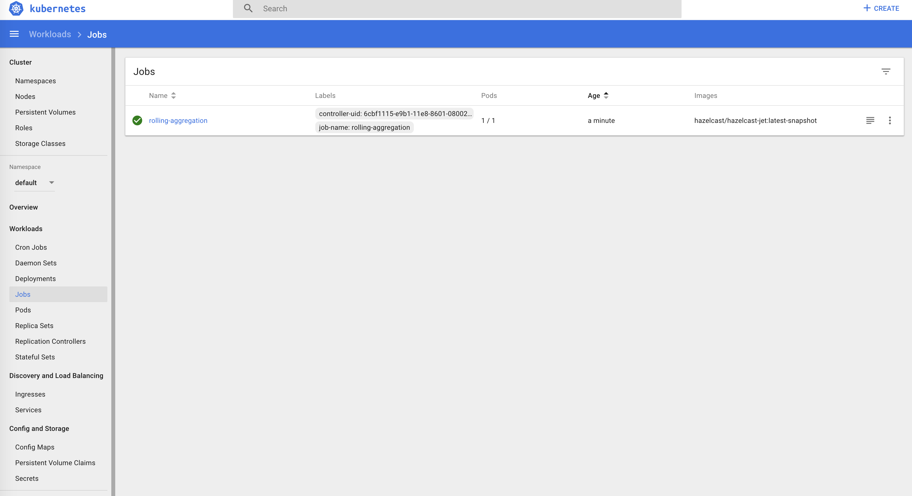
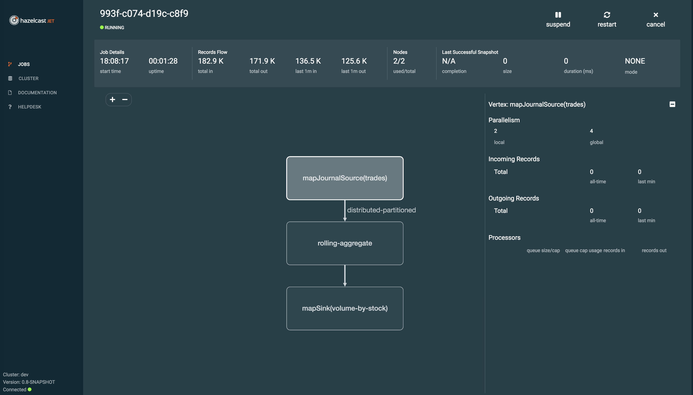

## Hazelcast Discovery Plugin for Kubernetes

The plugin provides the automatic member discovery in the Kubernetes
environment. It is included in Hazelcast Jet docker images and Hazelcast
Jet Helm charts.

This plugin supports two different options of how Hazelcast Jet members
discover each others:

- Kubernetes API
- DNS Lookup

### Kubernetes API

*Kubernetes API* mode means that each node makes a REST call to
Kubernetes Master in order to discover IPs of PODs (with Hazelcast Jet
members). Using Kubernetes API requires granting certain permissions.
Therefore, you may need to create a *Role Based Access Control* file.
See [Role Based Access Control](#role-based-access-control) section for
a sample file.

Hazelcast Kubernetes Discovery requires creating a service to PODs where
Hazelcast is running. In case of using Kubernetes API mode, the service
can be of any type.

### DNS Lookup

*DNS Lookup* mode uses a feature of Kubernetes that **headless**
(without cluster IP) services are assigned a DNS record which resolves
to the set of IPs of related PODs.

Headless service is a service of type *ClusterIP* with the `clusterIP`
property set to `None`.

The following table summarizes the differences between the discovery
modes: *Kubernetes API* and *DNS Lookup*

|             | Kubernetes API                                                                                                                                                                 | DNS Lookup                                                                                              |
|:------------|:-------------------------------------------------------------------------------------------------------------------------------------------------------------------------------|:--------------------------------------------------------------------------------------------------------|
| Description | Uses REST calls to Kubernetes Master to fetch IPs of PODs                                                                                                                      | Uses DNS to resolve IPs of PODs related to the given service                                            |
| Pros        | Flexible, supports 3 different options:    <ul><li>Cluster per service</li><li>Cluster per multiple services (distinguished by labels)</li><li>Cluster per namespace</li></ul> | No additional configuration required, resolving DNS does not require granting any permissions           |
| Cons        | Requires setting up RoleBinding (to allow access to Kubernetes API)                                                                                                            | <ul><li>Limited to **headless Cluster IP** service</li><li>Limited to **cluster per service**</li></ul> |

See
[Hazelcast Discovery Plugin for Kubernetes](https://github.com/hazelcast/hazelcast-kubernetes)
for more information about the plugin.

## Install Hazelcast Jet using Helm

The easiest way to install Hazelcast Jet on Kubernetes is using Helm
charts, Hazelcast Jet provides stable Helm charts for open-source and
enterprise versions also for Hazelcast Jet Management Center.

### Prerequisites

- Kubernetes 1.9+
- Helm CLI

### Installing the Chart

You can install the latest version with default configuration values
using below command:

```bash
helm install my-cluster stable/hazelcast-jet
```

This will create a cluster with the name `my-cluster` and with default
configuration values. To change various configuration options you can
use `–set key=value`:

```bash
helm install my-cluster --set cluster.memberCount=3 stable/hazelcast-jet
```

Or you can create a `values.yaml` file which contains custom
configuration options. This file may contain custom `hazelcast` and
`hazelcast-jet` yaml files in it too.

```bash
helm install my-cluster -f values.yaml stable/hazelcast-jet
```

### Uninstalling the Chart

To uninstall/delete the `my-release` deployment:

```bash
helm uninstall my-release
```

The command removes all the Kubernetes components associated with the
chart and deletes the release.

### Configuration

The following table lists some of the configurable parameters of the
Hazelcast Jet chart and their default values.

| Parameter                  | Description                                                                    | Default                    |
|:---------------------------|:-------------------------------------------------------------------------------|:---------------------------|
| `image.repository`         | Hazelcast Jet Image name                                                       | `hazelcast/hazelcast-jet`  |
| `image.tag`                | Hazelcast Jet Image tag                                                        | {VERSION}                  |
| `cluster.memberCount`      | Number of Hazelcast Jet members                                                | 2                          |
| `jet.yaml.hazelcast-jet`   | Hazelcast Jet Configuration (`hazelcast-jet.yaml` embedded into `values.yaml`) | `{DEFAULT_JET_YAML}`       |
| `jet.yaml.hazelcast`       | Hazelcast IMDG Configuration (`hazelcast.yaml` embedded into `values.yaml`)    | `{DEFAULT_HAZELCAST_YAML}` |
| `managementcenter.enabled` | Turn on and off Hazelcast Jet Management Center application                    | `true`                     |

See
[stable charts repository](https://github.com/helm/charts/tree/master/stable/hazelcast-jet)
for more information and configuration options.

## Install Hazelcast Jet without Helm

### Role Based Access Control

Hazelcast Jet provides Kubernetes-ready Docker images, these images use
the Hazelcast Kubernetes plugin to discover other Hazelcast Jet members
by interacting with the Kubernetes API. Therefore we need to create Role
Based Access Control definition, (`rbac.yaml`), with the following
content and apply it:

```yaml
apiVersion: rbac.authorization.k8s.io/v1
kind: ClusterRoleBinding
metadata:
  name: default-cluster
roleRef:
  apiGroup: rbac.authorization.k8s.io
  kind: ClusterRole
  name: view
subjects:
- kind: ServiceAccount
  name: default
  namespace: default
```

```bash
kubectly apply -f rbac.yaml
```

### ConfigMap

Then we need to configure Hazelcast Jet to use Kubernetes Discovery to
form the cluster. Create a file named `hazelcast-jet-config.yaml` with
following content and apply it. This will create a ConfigMap object.

```yaml
apiVersion: v1
kind: ConfigMap
metadata:
  name: hazelcast-jet-configuration
data:
  hazelcast.yaml: |-
    hazelcast:
      network:
        join:
          multicast:
            enabled: false
          kubernetes:
            enabled: true
            namespace: default
            service-name: hazelcast-jet-service
```

```bash
kubectl apply -f hazelcast-jet-config.yaml
```

### StatefulSet and Service

Now we need to create a *StatefulSet* and a *Service* which defines the
container spec. You can configure the environment options and the
cluster size here. Create a file named `hazelcast-jet.yaml` with
following content and apply it.

```yaml
apiVersion: apps/v1
kind: StatefulSet
metadata:
  name: hazelcast-jet
  labels:
    app: hazelcast-jet
spec:
  replicas: 2
  serviceName: hazelcast-jet-service
  selector:
    matchLabels:
      app: hazelcast-jet
  template:
    metadata:
      labels:
        app: hazelcast-jet
    spec:
      containers:
      - name: hazelcast-jet
        image: hazelcast/hazelcast-jet:latest
        imagePullPolicy: IfNotPresent
        ports:
        - name: hazelcast-jet
          containerPort: 5701
        livenessProbe:
          httpGet:
            path: /hazelcast/health/node-state
            port: 5701
          initialDelaySeconds: 30
          periodSeconds: 10
          timeoutSeconds: 5
          successThreshold: 1
          failureThreshold: 3
        readinessProbe:
          httpGet:
            path: /hazelcast/health/node-state
            port: 5701
          initialDelaySeconds: 30
          periodSeconds: 10
          timeoutSeconds: 1
          successThreshold: 1
          failureThreshold: 1
        volumeMounts:
        - name: hazelcast-jet-storage
          mountPath: /data/hazelcast-jet
        env:
        - name: JAVA_OPTS
          value: "-Dhazelcast.config=/data/hazelcast-jet/hazelcast.yaml"
      volumes:
      - name: hazelcast-jet-storage
        configMap:
          name: hazelcast-jet-configuration
---
apiVersion: v1
kind: Service
metadata:
  name: hazelcast-jet-service
spec:
  selector:
    app: hazelcast-jet
  ports:
  - protocol: TCP
    port: 5701
```

```bash
kubectl apply -f hazelcast-jet.yaml
```

## Deploy Jobs

There are two different ways to submit a job to a Hazelcast Jet cluster:

- Package Job as a Docker container then let it submit itself.
- Submit Job as a JAR file from a shared `PersistentVolume` which is
  attached to a pod.

For both options you need to create a `ConfigMap` object for the client
(`hazelcast-jet-client-config.yaml`) and apply it. Make sure that the
service-name is pointing to the service-name of the cluster we have
created above.

```yaml
---
apiVersion: v1
kind: ConfigMap
metadata:
  name: hazelcast-jet-client-configuration
data:
  hazelcast-client.yaml: |-
    hazelcast-client:
      cluster-name: jet
      network:
        kubernetes:
          enabled: true
          namespace: default
          service-name: hazelcast-jet-service
```

```bash
kubectl apply -f hazelcast-jet-client-config.yaml
```

### Package the Job as a Docker Container

There are several tools to containerize your job, for example
[Jib](https://github.com/GoogleContainerTools/jib/tree/master/jib-maven-plugin).
Jib builds Docker and OCI images for Java applications. It is available
as plugins for Maven and Gradle and as a Java library. You can find a
[sample-project](https://github.com/hazelcast/hazelcast-jet-docker/tree/master/examples/kubernetes#steps-to-package-the-job-as-a-docker-container)
using Jib to containerize the Hazelcast Jet rolling-aggregate job.

After creating the image, we create a *Kubernetes Job* using the image
and client ConfigMap object. The client config is stored in a volume,
mounted to the container and passed as an argument to the `jet submit`
script along with the name of the JAR containing the Jet job.

Create a file named `rolling-aggregation-via-docker.yaml` and apply it.

```yaml
---
apiVersion: batch/v1
kind: Job
metadata:
  name: rolling-aggregation
spec:
  template:
    spec:
      containers:
      - name: rolling-aggregation
        image: rolling-aggregation:latest
        imagePullPolicy: IfNotPresent
        command: ["/bin/sh"]
        args: ["-c", "jet -v -f /config/hazelcast-jet/hazelcast-client.yaml submit /rolling-aggregation-jar-with-dependencies.jar"]
        volumeMounts:
          - mountPath: "/config/hazelcast-jet/"
            name: hazelcast-jet-config-storage
      volumes:
      - name: hazelcast-jet-config-storage
        configMap:
          name: hazelcast-jet-client-configuration
          items:
            - key: hazelcast-client.yaml
              path: hazelcast-client.yaml
      restartPolicy: OnFailure
```

```bash
kubectl apply -f rolling-aggregation-via-docker.yaml
```

### Submit the Job from a Shared Persistent Volume

We will need a persistent volume attached to the pods. The persistent
storage will contain job JAR files to be submitted to the cluster. There
are many different ways you can define and map volumes in Kubernetes. We
will create `hostPath` persistent volume, which mounts a file or directory
from the host node’s filesystem into the pod. See
[official documentation](https://kubernetes.io/docs/concepts/storage/volumes/)
for other types of volumes.

Create a file named `persistent-volume.yaml` and apply it:

```yaml
---
kind: PersistentVolume
apiVersion: v1
metadata:
  name: rolling-aggregation-pv
  labels:
    type: local
spec:
  storageClassName: manual
  capacity:
    storage: 2Gi
  accessModes:
    - ReadWriteOnce
  hostPath:
    path: "/home/docker/jars-pv"
---
kind: PersistentVolumeClaim
apiVersion: v1
metadata:
  name: rolling-aggregation-pv-claim
spec:
  storageClassName: manual
  accessModes:
    - ReadWriteOnce
  resources:
    requests:
      storage: 1Gi
```

This will create a persistent volume which will use the
`/home/docker/jars-pv` directory as persistent volume on the kubernetes
node. We will mount the volume to the pods later. So we need to put the
job JAR inside this directory.

For `minikube` below commands will create the directory and copy the job
JAR into it.

```bash
ssh docker@$(minikube ip) -i $(minikube ssh-key) 'mkdir -p ~/jars-pv'
scp -i $(minikube ssh-key) rolling-aggregation-jar-with-dependencies.jar docker@$(minikube ip):~/jars-pv/
```

Now we can create the *Kubernetes Job* using Hazelcast Jet image and
client ConfigMap object. The client config and the copied job JAR is
stored in respective volumes, mounted to the container and passed as an
argument to the `jet submit` script.

Create a file named `rolling-aggregation.yaml` and apply it.

```yaml
---
apiVersion: batch/v1
kind: Job
metadata:
  name: rolling-aggregation
spec:
  template:
    spec:
      containers:
      - name: rolling-aggregation
        image: hazelcast/hazelcast-jet:latest-snapshot
        imagePullPolicy: IfNotPresent
        command: ["/bin/sh"]
        args: ["-c", "jet.sh -v -f /data/hazelcast-jet/hazelcast-client.yaml submit /job-jars/rolling-aggregation-jar-with-dependencies.jar"]
        volumeMounts:
          - mountPath: "/job-jars"
            name: rolling-aggregation-pv-storage
          - mountPath: "/data/hazelcast-jet/"
            name: hazelcast-jet-config-storage
      volumes:
      - name: rolling-aggregation-pv-storage
        persistentVolumeClaim:
          claimName: rolling-aggregation-pv-claim
      - name: hazelcast-jet-config-storage
        configMap:
          name: hazelcast-jet-client-configuration
          items:
            - key: hazelcast-client.yaml
              path: hazelcast-client.yaml
      restartPolicy: OnFailure
  backoffLimit: 4
```

```bash
kubectl apply -f rolling-aggregation.yaml
```

## Inspect Jobs

### With Kubernetes Dashboard

After you've run the job, you can open up Kubernetes Dashboard to see
it's status. To open Kubernetes Dashboard on `minikube` run the
following command:

```bash
minikube dashboard
```

This will open a browser window with the Kubernetes Dashboard. Then
navigate to *Jobs* section on left menu. You should be able to see your
job running/completed successfully like below and inspect the logs if
you like.



### With Hazelcast Jet Management Center

Hazelcast Jet Management Center enables you to monitor and manage your
cluster members running Hazelcast Jet. In addition to monitoring the
overall state of your clusters, you can also analyze and browse your
jobs in detail.

You can check
[Hazelcast Jet Documentation](http://docs.hazelcast.org/docs/jet/latest/manual)
and
[Hazelcast Jet Management Center Documentation](https://docs.hazelcast.org/docs/jet-management-center/latest/manual)
for more information.

#### Create a Secret with Enterprise Key

Hazelcast Jet Management Center requires a license key. Free trial is
limited to a single node, you can apply for a trial license key from
[here](https://hazelcast.com/hazelcast-enterprise-download). Store your
license key as a **Kubernetes Secret** with the following command.

```bash
kubectl create secret generic management-center-license --from-literal=key=MANAGEMENT-CENTER-LICENSE-KEY-HERE
```

#### Start Hazelcast Jet Management Center

We need to create a *Deployment* and a *Service* which defines container
spec. See that the secret we've created above passed to the container as
an environment variable and the client config is stored in a volume,
mounted to the container and passed as an argument to the java options.

```yaml
---
apiVersion: apps/v1
kind: Deployment
metadata:
  name: hazelcast-jet-management-center
spec:
  replicas: 1
  selector:
    matchLabels:
      app: hazelcast-jet-management-center
  template:
    metadata:
      labels:
        app: hazelcast-jet-management-center
    spec:
      containers:
      - name: hazelcast-jet-management-center
        image: hazelcast/hazelcast-jet-management-center:latest-snapshot
        imagePullPolicy: IfNotPresent
        volumeMounts:
        - name: hazelcast-jet-management-center-storage
          mountPath: /hazelcast-jet-config
        env:
        - name: JAVA_OPTS
          value: "-Djet.clientConfig=/hazelcast-jet-config/hazelcast-client.yaml"
        - name: MC_LICENSE_KEY
          valueFrom:
            secretKeyRef:
              name: management-center-license
              key: key
      volumes:
      - name: hazelcast-jet-management-center-storage
        configMap:
          name: hazelcast-jet-configuration
          items:
            - key: hazelcast-client.yaml
              path: hazelcast-client.yaml
---
apiVersion: v1
kind: Service
metadata:
  name: hazelcast-jet-management-center
spec:
  type: LoadBalancer
  selector:
    app: hazelcast-jet-management-center
  ports:
    - protocol: TCP
      port: 8081
      targetPort: 8081
```

You can obtain the accessible URL of the Hazelcast Jet Management Center
application like below. Navigating to that URL should welcome you to the
Hazelcast Jet Management Center.

```bash
minikube service hazelcast-jet-management-center --url
```



## Access From Outside The Kubernetes

While it is straightforward to access the Hazelcast Jet cluster inside
the Kubernetes (see [Deploy Jobs](#deploy-jobs) for a sample client
config), it is only possible with the public Internet network if you are
accessing the cluster from outside.

### Smart Routing Disabled

If you configure `smart-routing: false` for your client, you don't need
any plugin. It's enough to expose your Hazelcast Jet cluster with a
LoadBalancer (or NodePort) service and set its IP/port as the TCP/IP
Hazelcast Jet Client configuration. Remember that if smart-routing is
disabled then all all the communication happens against a single
Hazelcast Jet member.

### Smart Routing Enabled

To access a Hazelcast Jet cluster with a *smart* client you need to
perform the following steps:

- Expose each Hazelcast Jet Member POD with a separate LoadBalancer or
  NodePort service (the simplest way to do it is to install
  [Metacontroller](https://metacontroller.app/) and
  [service-per-pod](https://github.com/GoogleCloudPlatform/metacontroller/tree/master/examples/service-per-pod)
  Decorator Controller)
- Configure ServiceAccount with ClusterRole having at least `get` and
  `list` permissions to the following resources: `endpoints`, `pods`,
  `nodes`, `services`
- Use credentials from the created ServiceAccount in the Hazelcast Jet
  Client configuration (credentials can be fetched with:  
  `kubectl get secret <sevice-account-secret> -o jsonpath={.data.token}
  | base64 --decode` and  
  `kubectl get secret <sevice-account-secret> -o
  jsonpath={.data.ca\\.crt} | base64 --decode`)

```yaml
hazelcast-client:
  network:
    kubernetes:
      enabled: true
      namespace: MY-KUBERNETES-NAMESPACE
      service-name: MY-SERVICE-NAME
      use-public-ip: true
      kubernetes-master: https://35.226.182.228
      api-token: THE-API-TOKEN
      ca-certificate: |
        -----BEGIN CERTIFICATE-----
        ...
        -----END CERTIFICATE-----
```

**Note**: Hazelcast Jet Client outside Kubernetes cluster works only in
the *Kubernetes API* mode.

## Rolling Upgrade and Scaling

Hazelcast Jet cluster is easily scalable within Kubernetes. You can use
the standard `kubectl scale` command to change the cluster size. The
same applies the rolling upgrade procedure, you can depend on the
standard Kubernetes behavior and just update the new version to your
`Deployment/StatefulSet` configurations.

Note however that, by default, Hazelcast Jet does not shutdown
gracefully. It means that if you suddenly terminate more than your
backup-count property (1 by default), you may lose the cluster data. To
prevent that from happening, set the following properties:

- `terminationGracePeriodSeconds`: In your `StatefulSet/Deployment`
  configuration; the value should be high enough to cover the data
  migration process
- `-Dhazelcast.shutdownhook.policy=GRACEFUL`: In the JVM parameters
- `-Dhazelcast.graceful.shutdown.max.wait`: In the JVM parameters; the
  value should be high enough to cover the data migration process

Additionally if you use Deployment (not StatefulSet), you need to set
your strategy to
[RollingUpdate](https://kubernetes.io/docs/concepts/workloads/controllers/deployment/#updating-a-deployment)
and ensure Pods are updated one by one.

All these features are already included in Hazelcast Jet Helm Charts.
See
[Install Hazelcast Jet using Helm](#install-hazelcast-jet-using-helm)
for more information.
