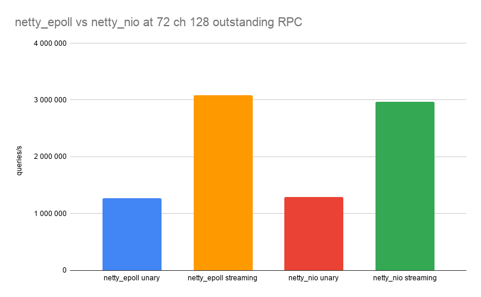
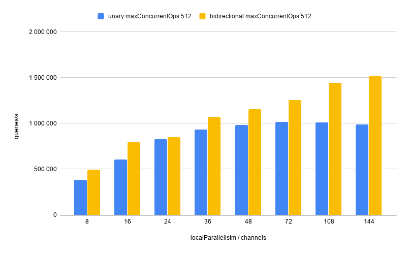
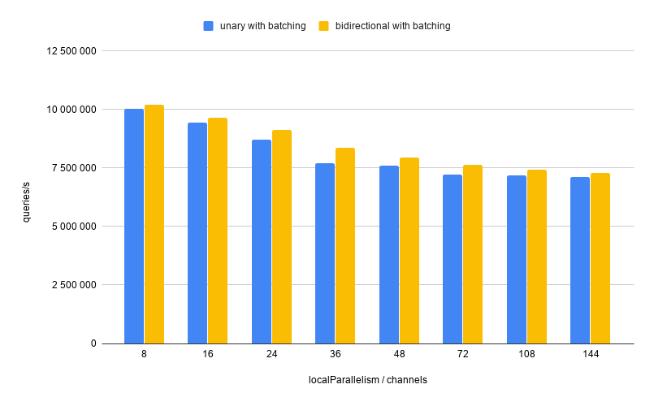
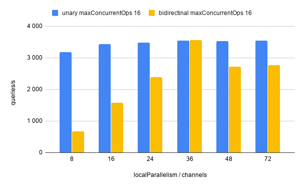
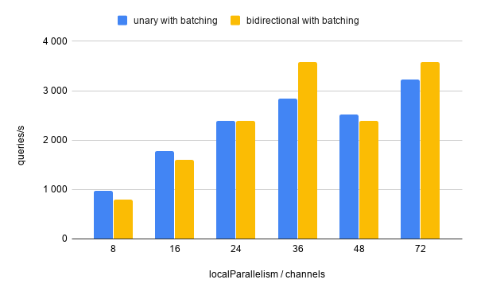

# Jet pipelines with gRPC

Implementing data processing pipelines occasionally requires calling an
external service. Examples are predicting/classifying based on a ML
model, looking up records from a database or a full-text search engine,
and using a dedicated platform that computes financial risk exposure.

These are the typical reasons why you'd want to have some processing
done outside of the Hazelcast Jet infrastructure: The service already
exists The service is implemented by another team or in a different
language The deployment of the service needs to be independent of the
deployment of the pipeline (e.g. you need to update ML model without
modifying the pipeline) Scaling the service independently of the
processing pipeline

The most ubiquitous way to interact between services nowadays is using
REST interfaces, or more generally HTTP endpoints with JSON as the
interchange format. This is a great choice for public-facing APIs due to
its simplicity and great support in terms of tooling, libraries, etc.
However, using JSON and the plain HTTP request-response cycle is not the
best for performance, and when you develop an internal service, simple
convenience is not as important as top performance.

# gRPC

gRPC is an RPC system that trades a bit of convenience for much better
performance, and also includes first-class support for several critical
concerns. Quoting from their website:

gRPC is a modern open source high performance RPC framework that can run
in any environment. It can efficiently connect services in and across
data centers with pluggable support for load balancing, tracing, health
checking and authentication.

With gRPC you define the service endpoint and the messages using
Protocol Buffers (Protobuf) and its interface description language
(IDL). The tooling then generates code for the server, serialization and
deserialization of the messages and the client. The gRPC Jet module then
makes it convenient to call the endpoint from a Jet pipeline.

The gRPC framework provides several RPC types, but most commonly used
are unary RPCs and bidirectional streaming RPCs. Unary RPC is what's
usually called just "RPC": the client sends a request and receives a
response. With bidirectional streaming RPC, the client starts a single
request and, within it writes any number of messages to the request
stream and receives any number of messages in the response stream, which
makes it more similar to a messaging system with 2 topics than RPC.  Use
gRPC from a Jet Pipeline

With Hazelcast Jet 4.1 we have released first-class support for
accessing gRPC endpoints from Jet pipelines. In this post we investigate
the performance of the gRPC-Java framework and the effects of various
settings on maximum throughput both in vanilla gRPC and in a Jet
environment.

Let’s start with an example of calling a gRPC endpoint from Jet.  For
example, given the protobuf definition below:
 
```proto 
service Greeter { // Sends a greeting rpc SayHello
(HelloRequest) returns (HelloReply) {} } 
```

We can create the following service factory:

```java 
var greeterService = unaryService( () ->
ManagedChannelBuilder.forAddress("localhost", 5000).usePlaintext(),
channel -> GreeterGrpc.newStub(channel)::sayHello); 
```

The first lambda returns a channel builder and can be used to modify the
channel settings. This will turn out important for our investigation.

The second lambda takes a gRPC client channel obtained from the builder
and returns a function which Jet will call for each item of the
pipeline. The class `GreeterGrpc` is auto-generated by gRPC and its
`newStub` method creates the client stub. You can change the default
settings before returning it from the lambda. We won’t modify this
further in our investigation.

This service can then be used in the pipeline with the
`mapUsingServiceAsync` stage:

```java 
BatchStage<Integer> stage = ...
stage.mapUsingServiceAsync(unaryService, (service, item) ->
service.call(HelloRequest.newBuilder().setValue(item).build())) 
```

For a full guide on how to use Jet's gRPC functionality and API details,
please see the manual.  The environment We ran the benchmarks in AWS on
2 instances of type c5.9xlarge. This instance type has: 36 vCPUs 76 GiB
of RAM 10 Gigabit network. One instance ran a single Hazelcast Jet
member, the other one ran the gRPC server. We also run the benchmarks on
our local development machines, obviously yielding different results.
The gRPC benchmarks The gRPC-Java framework provides its own set of
benchmarks. We will use these to establish a baseline to compare with
the performance of our Jet pipeline. The benchmark consists of running a
gRPC server and a client.

To run the server we run 

```
 ./grpc-benchmarks/bin/qps_server
--address=$SERVER --transport=netty_epoll 
```

And to run the client 
``` 
grpc-benchmarks/bin/qps_client
--address=$SERVER --transport=netty_epoll --channels=36
--outstanding_rpcs=64 --client_payload=8 --server_payload=8 
```

The parameters relevant for our investigation are 
* --transport - possible
values are netty_epoll and netty_nio, netty_epoll should be most
performant, but it is only available on Linux 
* --channels - number of
channels to create on the client side 
* --outstanding_rpcs - how many
requests per channel are submitted at the same time
* --client_payload and
--server_payload - size of the payload sent in a request/response
* --streaming_rpcs - when present bidirectional streaming endpoint is
used, otherwise unary endpoint is used

The output is as follows: 

```
Channels:                          36
Outstanding RPCs per Channel:      64 Server Payload Size:
8 Client Payload Size:                8 50%ile Latency (in micros):
1951 90%ile Latency (in micros):      3695 95%ile Latency (in micros):
5183 99%ile Latency (in micros):     10559 99.9%ile Latency (in micros):
15807 Maximum Latency (in micros):    37375 QPS:
986128 
```

We are mainly interested in QPS - Queries Per Second. The results are
quite interesting. We can clearly see that the number of channels is the
most important factor, using 72 or 108 channels instead of just one can
provide 20x or 30x more throughput.


The number of outstanding RPCs seems to have a sweet spot with a value
of 128 or 256.

As for the transport epoll and NIO transport types - it seems that for
unary calls they both reach similar maximum performance, but overall,
NIO is better. For streaming calls, epoll wins in maximum performance
with similar results using 108 channels and 128 outstanding RPCs or 72
channels and 256 outstanding RPCs. With other settings there doesn’t
seem to be a clear winner.



The full data is available in this
[spreadsheet](https://docs.google.com/spreadsheets/d/1psjHF5ZRlxYAwxn4LA_XhvYKB0KuLXMHW8iEjrUAteE/edit#gid=63601685).  

# Jet Benchmarks

We have created 2 types of workloads on the gRPC server side: Very fast
computation (integer multiplication) CPU-bound task taking 10 ms

We have ran each workload as: Unary RPC Bidirectional streaming RPC

In the Jet pipeline we don’t have exactly the same parameters as in the
gRPC benchmark, but there are similar parameters: Local parallelism of
the `mapUsingServiceAsync` step dictates the number of mapping
processors, each processor has its own channel instance so this is
roughly equivalent to the number of channels.  The parameter
`maxConcurrentOps` says how many concurrent asynchronous mapping
operations there can be at one time. This is similar to the number of
outstanding RPCs, but not exactly the same.

We also tried each RPC with a modified message type containing a batch
of messages in combination with mapUsingServiceAsynchBatched. This is
not always possible to do - you need to be able to change the interface
of the server, but if you can it provides a huge boost to the
throughput. 

Jet uses what is sometimes called natural or smart batching. Typically a
batching algorithm creates batches of fixed size or waits fixed time to
create a batch. This increases latency in low throughput scenarios.
Smart batching creates batches from currently available items - when the
traffic is low small batches (even of size 1) are possible, with high
traffic larger batches are created, limited to size of maxBatchSize
parameter.

## Fast computation benchmark

This benchmark is very similar to the benchmark from gRPC repo. It is
doing minimal work on the gRPC server side and measures overhead of the
Jet pipeline and network.

First let’s compare to the gRPC benchmark. We achieve similar (slightly
lower) results for unary RPC, and about a half for bidirectional
streaming. It’s good that we don’t get e.g. 10x less, but the drop for
bidirectional streaming is rather surprising.

Similar to the gRPC benchmark we see that to achieve maximum throughput
we need to increase the number of channels and maxConcurrentOps
parameter.



The results change completely with the modified batch endpoint. First,
we see that we achieve roughly 7x more throughput with smart batching.
Secondly, we need less channels to achieve that, and thirdly, there is
little difference between unary and bidirectional streaming, though
bidirectional is still slightly better in all cases. Note that for this
benchmark there is no maxConcurrentOps setting, because
mapUsingServiceAsyncBatched doesn't take it as a parameter and uses a
default.



## CPU bound task of 10 ms

This benchmark simulates a task which takes 10 ms and is CPU bound.
Because our testing machine has 36 vCPUs the theoretical maximum
throughput is 3600 requests/s.

Interestingly, we can see that unary RPC reaches maximum possible
throughput for all settings, however bidirectional only for 36 channels.
The results don’t change significantly for different maxConcurrentOps
settings.



In this scenario using smart batching doesn’t seem to be such a clear
decision.  Unary only gets close to a maximum with 72 channels.
Bidirectional achieves maximum throughput with both 36 and 72 channels.



# Conclusion

We can draw several conclusions from our investigation: there is no
silver bullet, the results vary significantly with workload type,
network speed and latency, resources available; Bidirectional streaming
is faster than unary, roughly 2x in our case; For both unary and
bidirectional streaming endpoints increasing number of channels provides
better throughput, number of CPUs on the gRPC server side might be a
good starting point; This changes with batched endpoints, they give much
higher throughput at lowe number of channels; This changes again when
the task itself takes much longer than the network (our 10 ms CPU bound
task).

So in any case you should test in your environment for best settings.

The benchmark code is published here < add link to repo>

The spreadsheet with all the results can be seen here.

