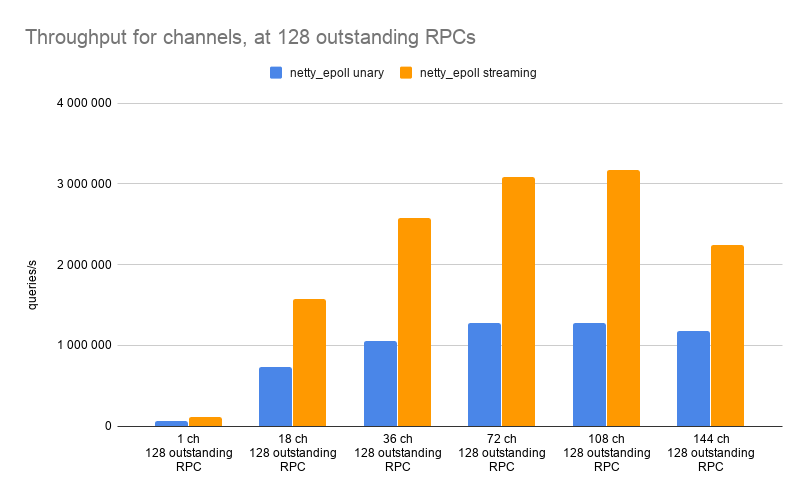
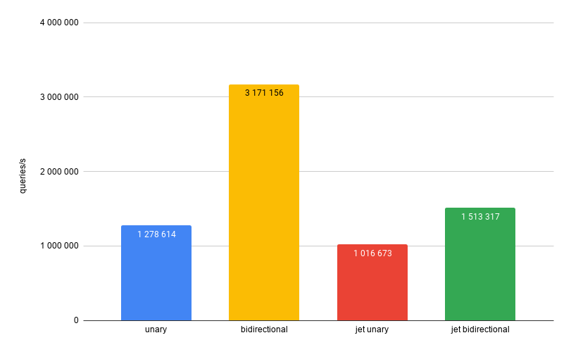
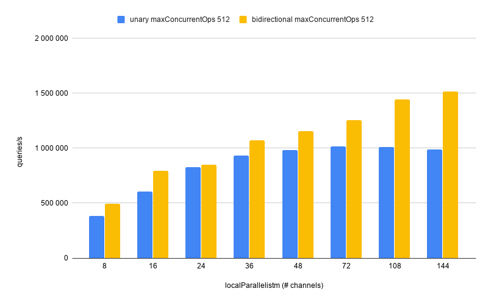
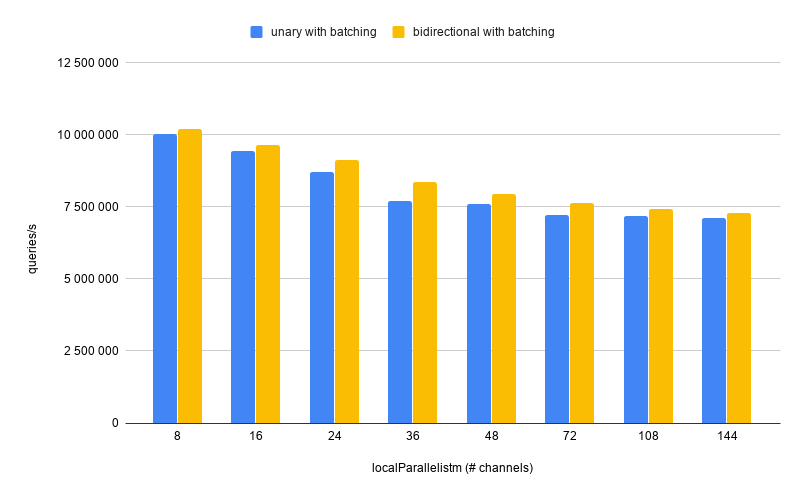
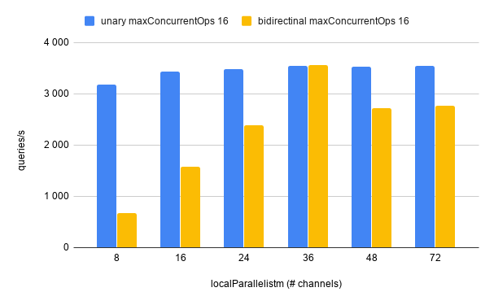
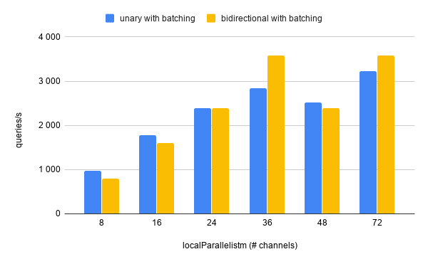

Implementing data processing pipelines occasionally requires calling an
external service, for example: predicting/classifying based on a ML
model, looking up records from a database or a full-text search engine,
and using a dedicated platform that computes financial risk exposure.

These are the typical reasons why you'd want to have some processing
done outside of the Hazelcast Jet infrastructure:

* The service already exists
* The service is implemented by another team or in a different language
* The deployment of the service needs to be independent of the
  deployment of the pipeline (e.g. you need to update ML model without
  modifying the pipeline)
* Scaling the service independently of the processing pipeline

## gRPC

[gRPC](https://grpc.io/) is an RPC system that trades a bit of
convenience for much better performance, and also includes first-class
support for several critical concerns. Quoting from their website:

> gRPC is a modern open source high performance RPC framework that can run
in any environment. It can efficiently connect services in and across
data centers with pluggable support for load balancing, tracing, health
checking and authentication.

With gRPC you define the service endpoint and the messages using
Protocol Buffers (Protobuf) and its interface description language
(IDL). The tooling then generates code for the server, serialization and
deserialization of the messages, and the client. Hazelcast Jet's gRPC
module makes it convenient to use the generated code to call the
endpoint from a Jet pipeline.

The gRPC framework provides several RPC types, but most commonly used
are unary RPC and bidirectional streaming RPC. Unary RPC is what's
usually called just "RPC": the client sends a request and receives a
response. With bidirectional streaming RPC, the client starts a single
request, writes any number of messages to the request stream. Then the
client receives any number of messages in the response stream, which
makes it more similar to a messaging system with 2 topics than RPC.  

## Using gRPC from a Jet Pipeline

With Hazelcast Jet 4.1 we have released first-class support for
accessing gRPC endpoints from Jet pipelines. In this post we investigate
the performance of the [gRPC-Java](https://github.com/grpc/grpc-java)
framework and the effects of various settings on maximum throughput both
in vanilla gRPC and in a Jet environment.

Let’s start with an example of calling a gRPC endpoint from Jet.  For
example, given this protobuf definition:

```proto
service Greeter {
  // Sends a greeting rpc SayHello
  (HelloRequest) returns (HelloReply) {}
}
```

We can create the following service factory:

```java
var greeterService = unaryService( () ->
  ManagedChannelBuilder.forAddress("localhost", 5000).usePlaintext(),
  channel -> GreeterGrpc.newStub(channel)::sayHello
);
```

The first lambda returns a client channel builder. Jet uses the builder
you provide to create gRPC channels, which correspond to network
connections. You can set any desired configuration options on the
builder, such as compression and encryption. These will turn out to be
relevant to our investigation.

The second lambda takes a gRPC client channel obtained from the builder
and returns a function which Jet will call for each item of the
pipeline. The class `GreeterGrpc` is auto-generated by gRPC and its
`newStub` method creates the client stub. You can change the default
settings before returning it from the lambda. We won’t modify this
further in our investigation.

Once you have constructed a `ServiceFactory`, you can pass it to a Jet
pipeline stage transform such as `mapUsingServiceAsync`. Jet uses the
factory to create instances of the service, and passes these to the
lambda you provide. Here's an example:

```java
BatchStage<Integer> stage = ...
stage.mapUsingServiceAsync(greeterServiceFactory, (service, item) ->
    service.call(HelloRequest.newBuilder().setValue(item).build()))
```

The word `Async` in the stage transform name means that the lambda
function must return a `CompletableFuture<T>`, and in our case
`service.call()` returns just that.

## The environment

We ran the benchmarks in AWS on
2 instances of type c5.9xlarge. This instance type has:

* 36 vCPUs
* 76 GiB of RAM
* 10 Gigabit network.

One instance ran a single Hazelcast Jet
member, the other one ran the gRPC server.

## The gRPC Benchmarks

The gRPC-Java framework provides its own set of
[benchmarks](https://github.com/grpc/grpc-java/tree/master/benchmarks).
We will use these to establish a baseline to compare with the
performance of our Jet pipeline. The benchmark consists of running a
gRPC server and a client.

We issued this command to start the server:

```bash
./grpc-benchmarks/bin/qps_server --address=$SERVER --transport=netty_epoll
```

And to run the client:

```bash
grpc-benchmarks/bin/qps_client --address=$SERVER --transport=netty_epoll \
  --channels=36 --outstanding_rpcs=64 --client_payload=8 --server_payload=8
```

The parameters relevant to our investigation are:

* --transport - possible values are netty_epoll and netty_nio,
  netty_epoll should be most performant, but it is only available on
  Linux
* --channels - number of channels (i.e., network connections) to create
  on the client side
* --outstanding_rpcs - how many requests per channel to submit without
  waiting for a response
* --client_payload and --server_payload - size of the payload sent in a
  request/response
* --streaming_rpcs - when present, uses a bidirectional streaming
  endpoint, otherwise a unary endpoint

Here's an example of of the output:

```text
Channels:                          36
Outstanding RPCs per Channel:      64
Server Payload Size:                8
Client Payload Size:                8
50%ile Latency (in micros):      1951
90%ile Latency (in micros):      3695
95%ile Latency (in micros):      5183
99%ile Latency (in micros):     10559
99.9%ile Latency (in micros):   15807
Maximum Latency (in micros):    37375
QPS:                           986128
```

Our focus for this benchmark was throughput, so we focused on the QPS
metric - Queries Per Second. The results are quite interesting: we could
clearly identify the number of channels as the most important factor.
Using 72-108 channels increased the throughput by 20x-30x, compared to
the baseline of one channel. Since we're using very small messages,
per-message overhead inside the gRPC layer dominates over the network
limits. This is why you can achieve more throughput by adding more
channels.



The number of outstanding RPCs seems to have a sweet spot with a value
of 128 or 256 for this particular configuration of instance type,
network and benchmark parameters. With very low message processing time,
the optimal number of outstanding RPCs is mostly dictated by the number
of in-flight messages in the network layer. To a first approximation,
this number equals network throughput in terms of messages per second,
multiplied by the roundtrip latency of one message. Our messages are
very small, so the optimal number of outstanding RPCs is quite high.

As for the transport epoll and NIO transport types - it seems that for
unary calls they both reach similar maximum performance, but overall,
NIO is better.  For streaming calls, epoll wins in maximum performance
with similar results using 108 channels and 128 outstanding RPCs or 72
channels and 256 outstanding RPCs. With other settings there doesn’t
seem to be a clear winner.


All charts present best results for various configurations of number of
channels, outstanding RPC etc. The full data is available in this
[spreadsheet](https://docs.google.com/spreadsheets/d/1psjHF5ZRlxYAwxn4LA_XhvYKB0KuLXMHW8iEjrUAteE/edit#gid=63601685)
.

## Jet Benchmarks

We created 2 types of workloads on the gRPC server side:

* Very fast computation (integer multiplication)
* CPU-bound task taking 10 ms

We ran each workload as:

* Unary RPC
* Bidirectional streaming RPC

In the Jet pipeline we don’t have the exact same parameters as in the
gRPC benchmark, but there are similar ones:

* Local parallelism of the `mapUsingServiceAsync` step dictates the
  number of mapping processors, each processor has its own channel
  instance so this is roughly equivalent to the number of channels.
* The parameter `maxConcurrentOps` specifies how many concurrent
  asynchronous mapping operations each Jet processor can issue without
  waiting for a response. This gives you control over the same aspect as
  the number of outstanding RPCs, but in a less direct way.
  
This is the pipeline for a unary service, all the other benchmark
pipelines follow the same pattern:

```java
Pipeline p = Pipeline.create();
BatchStage<Integer> stage = p.readFrom(intSource(jobBatchSize));
stage.mapUsingServiceAsync(unaryService,
       maxConcurrentOps, true,
       (service, item) -> service.call(HelloRequest.newBuilder().setValue(item).build()))
    .setLocalParallelism(localParallelism)
    .aggregate(AggregateOperations.counting())
    .writeTo(Sinks.observable(runId));
```

## Fast computation benchmark

This benchmark is very similar to the benchmark from gRPC repo. It is
doing minimal work on the gRPC server side and measures overhead of the
Jet pipeline and network.

First let’s compare this with the gRPC benchmark. We achieve similar
(slightly lower) results for unary RPC, and about half for bidirectional
streaming. It’s good that we don’t get e.g. 10x less, but the drop for
bidirectional streaming is rather surprising.

Best throughput results achieved in gRPC benchmark and Jet benchmark:



Similar to the gRPC benchmark, we can observe that to achieve maximum
throughput we need to increase the number of channels and the
maxConcurrentOps parameter.



## Batch endpoint

We also tried each RPC with a modified message type containing a batch
of messages in combination with `mapUsingServiceAsynchBatched`. This is
not always possible to do - you need to be able to change the interface
of the server, but if you can, it provides a huge boost to the
throughput.

Jet uses what has been variously called natural or [smart
batching](https://mechanical-sympathy.blogspot.com/2011/10/smart-batching.html).
Typically, a batching algorithm creates batches of fixed size or waits
for a fixed time to create a batch. This increases latency in
low-throughput scenarios. Smart batching instead creates a batch from
whatever items came in while the previous batch was being processed.
When the traffic is low, this results in small batches (including single
items), preserving the best possible latency, and as the traffic grows,
larger batches automatically form, up to the limit set by the
maxBatchSize parameter.

After modifying the endpoint to work with batches, our results improved
dramatically:

1. Smart batching increased the throughput by roughly 7x.
1. We needed less channels (i.e., less system resources) to reach the
   maximum throughput.
1. Even though bidirectional streaming remained a winner, its advantage
   over unary became very slim.

Note that for this benchmark there is no maxConcurrentOps setting,
because `mapUsingServiceAsyncBatched` doesn't have it as a configurable
option.



## CPU bound task of 10 ms

This benchmark simulates a task that takes 10 ms to complete and is
CPU-bound.  Because our testing machine has 36 vCPUs, the theoretical
maximum throughput is 3600 requests/s.

Interestingly, we can see that unary RPC reaches the maximum possible
throughput for all settings, however bidirectional only for 36 channels.
The results don’t change significantly for different maxConcurrentOps
settings.



In this scenario, smart batching no longer has a significant edge. Unary
only gets close to a maximum with 72 channels. Bidirectional achieves
maximum throughput with both 36 and 72 channels.



## Conclusion

We can draw several conclusions from our investigation:

* There is no silver bullet, the results vary significantly with
  workload type, network speed and latency, resources available (e.g. on
  a local development machine the benchmark yields different results).
* Bidirectional streaming is faster than unary, roughly 2x in our case.
* For both unary and bidirectional streaming endpoints increasing the
  number of channels provides better throughput, number of CPUs on the
  gRPC server side might be a good starting point.
* Batched endpoints make a big difference, allowing much higher
  throughput with less channels.
* The execution duration of the task also makes a significant
  difference, especially when taking longer than the network roundtrip
  (our 10 ms CPU bound task).

So in any case you should test in your environment and your own workload
to find the most advantageous setup.

## Links

For a full guide on how to use Jet's gRPC functionality and API details,
please see the [manual](../docs/how-tos/grpc.md).

The benchmark code is published on
[github.com](https://github.com/frant-hartm/hazelcast-jet-grpc-benchmark)

The spreadsheet with all the results can be seen
[here](https://docs.google.com/spreadsheets/d/1psjHF5ZRlxYAwxn4LA_XhvYKB0KuLXMHW8iEjrUAteE/edit#gid).
