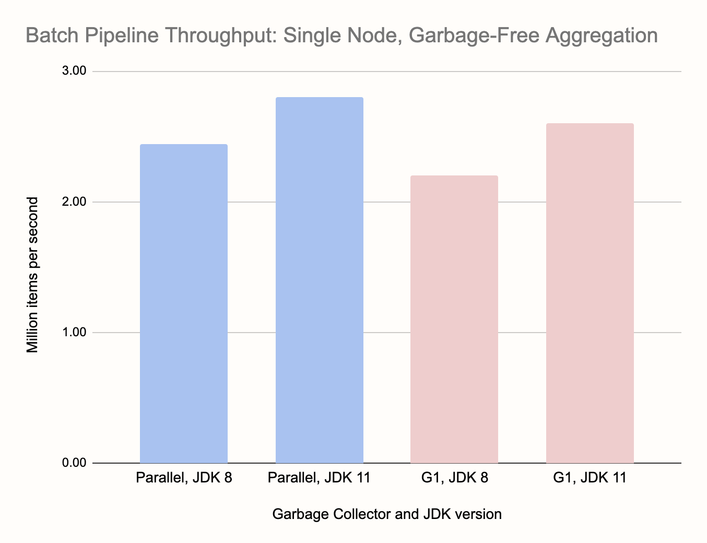
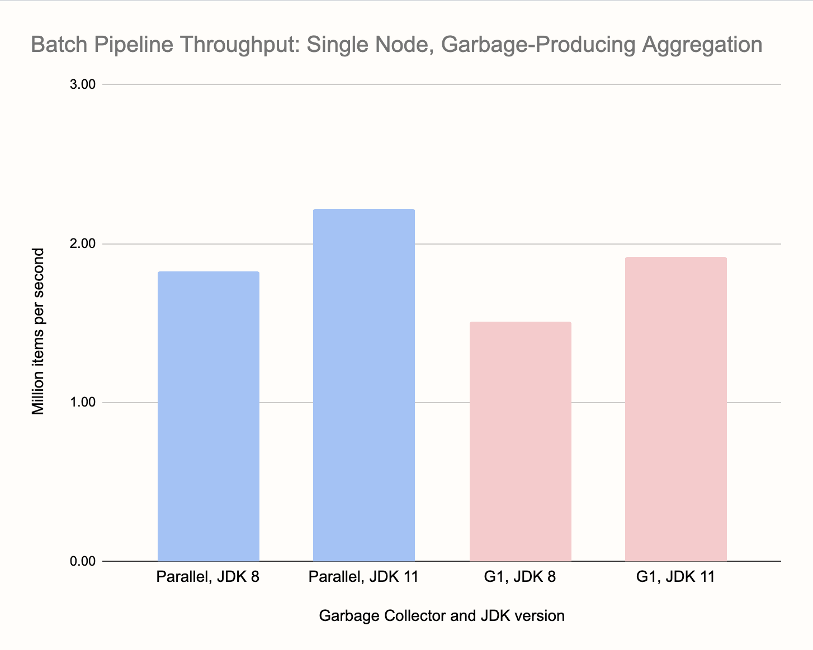
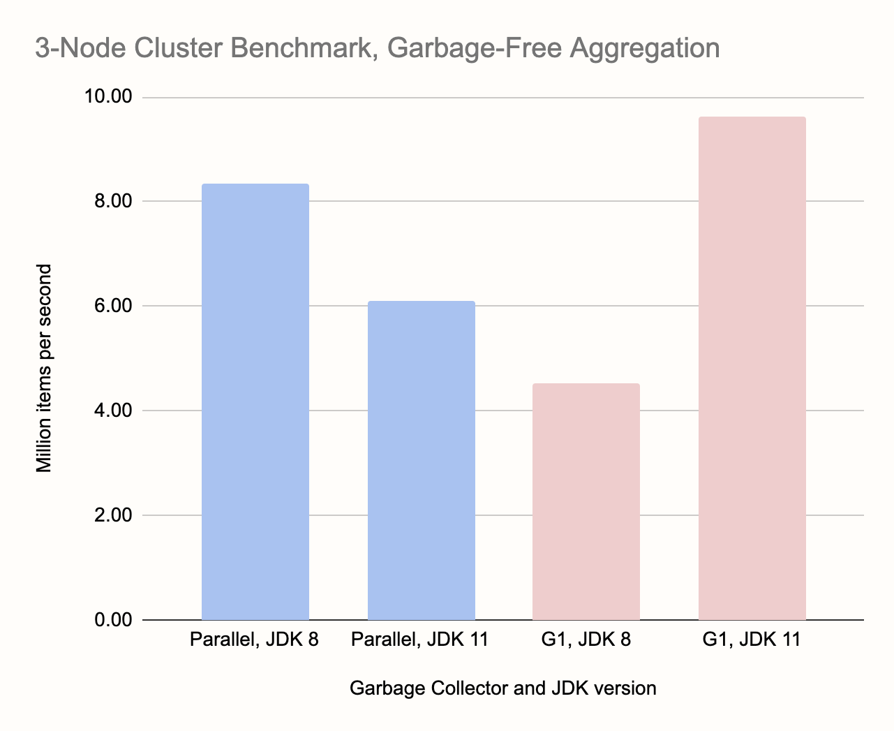

## Batch Pipeline Benchmark

A batch pipeline processos a finite amount of stored data. There are no
running results, we need the output of the aggregate function applied to
the entire dataset. This changes our performance requirements: the key
factor in streaming, latency, doesn't exist here since we are not
processing data in real time. The only metric that matters is the total
run time of the pipeline.

For this reason we considered the Parallel GC as a relevant candidate.
In the first testing round, on a single node, it actually delivered the
best throughput (but only after GC tuning). However, it achieves that
throughput at the expense of GC pause duration. In a cluster, whenever
any node enters a GC pause, it stalls the whole data pipeline. Since
individual nodes enter GC pauses at different times, the amount of time
spent in GC goes up with every node you add to the cluster. We explored
this effect by comparing single-node tests with tests in a three-node
cluster.

On the flip side, we did not consider the experimental low-latency
collectors in this round since their very short GC pauses have no effect
on the test result, and they achieve them at the expense of throughput.

### Single-Node Benchmark: The Pipeline

For the single-node batch benchmark we used this simple pipeline, full
code on
[GitHub](https://github.com/mtopolnik/jet-gc-benchmark/blob/master/src/main/java/org/example/BatchBenchmark.java):

```java
p.readFrom(longSource)
 .rebalance() // Introduced in Jet 4.2
 .groupingKey(n -> n / % NUM_KEYS)
 .aggregate(summingLong(n -> n))
 .filter(e -> (e.getKey() & 0xFF_FFFFL) == 0)
 .writeTo(Sinks.logger())
```

The source is again a self-contained mock source that just emits a
sequence of `long` numbers and the key function is defined so that the
grouping key cycles through the key space: 0, 1, 2, ..., `NUM_KEYS`, 0,
1, 2, ... This means that, over the first cycle, the pipeline observes
all the keys and builds up a fixed data structure to hold the
aggregation results. Over the following cycles it just updates the
existing data. This aligns perfectly with the Generational Garbage
Hypothesis: the objects either last through the entire computation or
are short-lived temporary objects that become garbage very soon after
creation.

We let our source emit 400 million items and had 100 million distinct
keys, so we cycled four times over the same keys.

The `.rebalance()` operator changes Jet's default [two-stage
aggregation](/docs/concepts/dag#group-and-aggregate-transform-needs-data-partitioning)
to single-stage. It exhibited more predictable behavior in our
benchmark.

We also tested a variant where the aggregate operation uses a boxed
`Long` instance as state, producing garbage every time the running score
is updated. In this case the garbage isn't strictly generational because
the objects die after having spent substantial time in the old
generation. For this variant we had to reduce the number of keys to 70
million, with 100 million the GC pressure was too high.

For the batch pipeline we didn't focus on the low-latency collectors
since they have nothing to offer in this case. Also, because we saw
earlier that JDK 14 performs much the same as JDK 11, we just ran one
test to confirm it, but otherwise focused on JDK 8 vs. JDK 11 and
compared the JDK 8 default Parallel collector with G1.

### Single-Node Benchmark: The Results

For single-node testing, we ran the benchmark on a laptop with 16 GB RAM
and a 6-core Intel Core i7. We used a heap size of 10 GB.

Initially we got very bad performance out of the Parallel collector and
had to resort to GC tuning. For this purpose we highly recommend using
VisualVM and its Visual GC plugin. When you set the frame rate to the
highest setting (10 FPS), you can enjoy a very fine-grained visual
insight into how the interplay between your application's allocation and
the GC works out. By watching these live animations for a while, we
realized that the main issue was a too large slice of RAM given to the
new generation. By default the ratio between Old and New generations is
just 2:1, and it is not dynamically adaptable at runtime. Based on this
we decided to try with `-XX:NewRatio=8` and it completely changed the
picture. Now Parallel was turning in the best times overall. We also
used `-XX:MaxTenuringThreshold=2` to reduce the copying of data between
the Survivor spaces, since in the pipeline the temporary objects die
pretty soon.

Now, on to the results. The only relevant metric in this batch pipeline
benchmark is the time for the job to complete. To visualize the results
we took the reciprocal of that, so the charts show throughput in items
per second. Here are our results on a single node:





Comparing the two charts we can see that garbage-free aggregation gave a
throughput boost of around 30-35%, and that's despite the larger keyset
we used for it. G1 on JDK 8 was the worst performer and the fine-tuned
Parallel on JDK 11 was the best. G1 on JDK 11 wasn't far behind. Note
that we didn't have to touch anything in the configuration of G1, which
is an important fact. GC tuning is highly case-specific, the results may
dramatically change with e.g., more data, and it must be applied to the
entire cluster, making it specifically tuned for one kind of workload.

Here's the performance of the default Parallel GC compared to the tuned
version we used for testing:


With 10 GB of heap it failed completely, stuck in back-to-back Full GC
operations each taking about 7 seconds. With more heap it managed to
make some progress, but was still hampered with very frequent Full GCs.
Note that we got the above results for the most favorable case, with
garbage-free aggregation.

### Three-Node Cluster Benchmark: The Pipeline

To properly benchmark in the cluster, we had to use a bit more complex
[pipeline](https://github.com/mtopolnik/jet-gc-benchmark/blob/master/src/main/java/org/example/ClusterBatchBenchmark.java):

```java
p.readFrom(longSource())
 .rebalance()
 .flatMap(n -> {
     Long[] items = new Long[SOURCE_STEP];
     Arrays.setAll(items, i -> n + i);
     return traverseArray(items);
 })
 .rebalance()
 .groupingKey(n -> n % NUM_KEYS)
 .aggregate(AggregateOperations.summingLong(n -> n))
 .filter(e -> e.getKey() % 1_000_000 == 0)
 .writeTo(Sinks.logger())
;
```

Since the source is non-parallel, we applied some optimizations so it
doesn't become a bottleneck. We let the source emit the numbers 0, 10,
20, ... and then applied a parallelized `flatMap` stage that
interpolates the missing numbers. We also used `rebalance()` between the
source and `flatMap`, spreading the data across the cluster. We applied
rebalancing again before entering the main stage, keyed aggregation.
After the aggregation stage we first reduce the output to every
millionth key-value pair and then send it to the logger. We used one
billion data items and a keyset of half a billion.

Same as on single-node, we tested both this pipeline, with a garbage-free
aggregation, and a modified one with garbage-producing aggregation.

### Three-Node Cluster Benchmark: The Results

We performed this benchmark on an AWS cluster of three c5d.4xlarge
instances. They have 16 virtualized CPU cores and 32 GB of RAM. The
network is 10 Gbit/s. Here are the results:




In passing, let's note the overall increase in throughput compared to
single-node benchmarks, about three times. That's the advantage of
distributed processing. As for collectors, G1 on JDK 11 is the clear
winner in both tests. Another strking result is the almost nonexistent
bar for G1 on JDK 8, however there's a deeper story here that affects
other measurements as well, for example the apparent advantage of
Parallel GC on JDK 8 vs. JDK 11. It has to do with the effect we noted
at the outset: a GC pause on any one member halts the processing on the
entire cluster. G1 on JDK 8 enters very long GC pauses, more than a
minute. This is enough to trigger the cluster's failure detector and
consider the node dead. The job fails, the cluster reshapes itself, and
then the job restarts on just two nodes. This, naturally, fails even
sooner because there's more data on each member. In the meantime the
kicked-out node has rejoined, so the job restarts on two nodes again,
but different ones. We end up in an endless loop of job restarts.

As we noted before, the G1 on JDK 8 has very bad Full GC pauses, that's
why it fared the worst in the cluster test. The Parallel collector
didn't bring down the cluster, but it fared significantly worse than in
single-node tests. Here it was 30% behind the G1 on JDK 11. With a
bigger cluster this would get even worse.

Compared to all other tests, it is surprising to see Parallel on JDK 8
win over JDK 11, however this is due to a very lucky coincidence that,
in those particular test runs, the Full GC pauses got synchronized on
all nodes, parallelizing the effort of the GC. Clearly, this is not a
reliable effect.

Even though in the particular benchmark setup which we report here, we
didn't observe the catastrophic consequence of long GC pauses while
using the Parallel collector, it is more of a chance outcome. In other
tests, where we used a larger heap and more data, or the same heap but
with less headroom left, the Parallel collector did cause the same
damage. However, even when it doesn't cause outright failure, the charts
show the advantage it had on a single node has disappeared. You can
expect the results to get worse with each further node you add to the
cluster.

The JDK 11 G1 collector, on the other hand, was producing GC pauses of a
sufficiently short duration that the rest of the pipeline didn't get
stalled. The pipeline has mechanisms that dampen out short hiccups and
as long as the GC pauses are within acceptable limits (up to some 150
ms), the effect of GC stays local.
