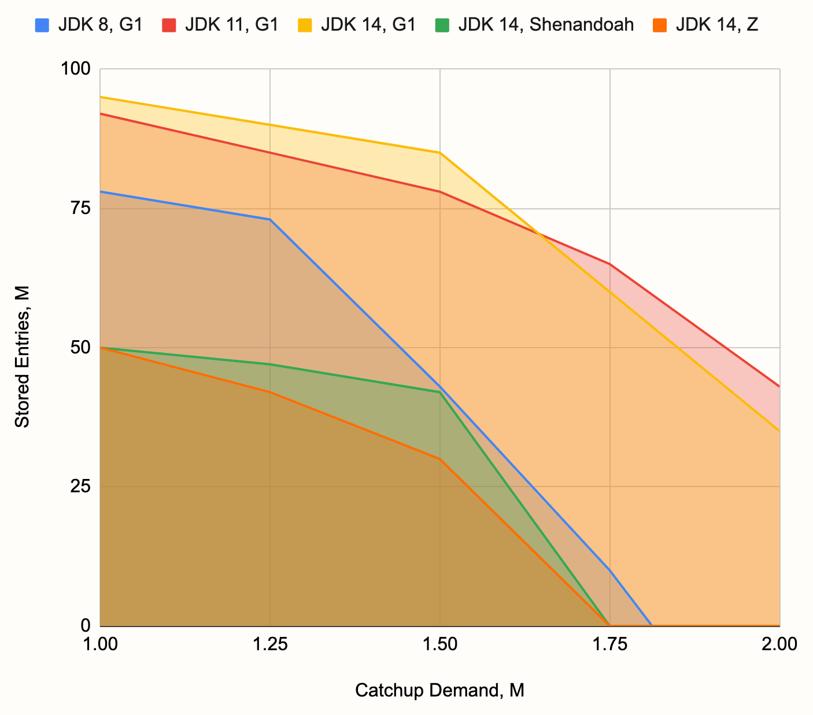
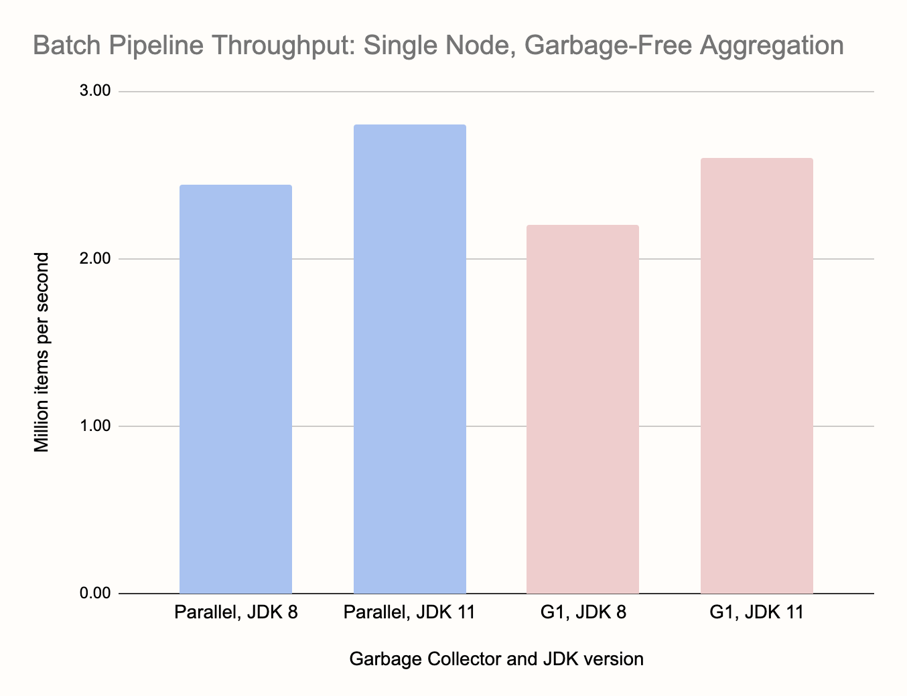
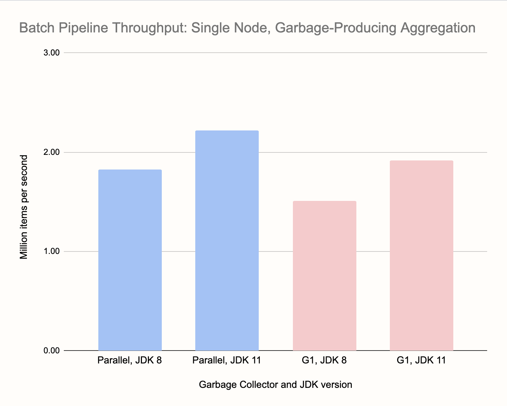

The Java runtime has been evolving more rapidly in recent years and,
after 15 years, we finally got a new default garbage collector: the
G1. Two more GCs are on their way to production and are available as
experimental features: Oracle's Z and OpenJDK's Shenandoah. We at
Hazelcast thought it was time to put all these new options to the test
and find which choices work well with distributed stream processing in
Hazelcast Jet.

Jet is being used for a broad spectrum of use cases, with different
latency and throughput requirements. Here are three important
categories:

1. Low-latency unbounded stream processing, with moderate state. Example:
  detecting trends in 500 Hz sensor data from 100,000 devices and
  sending corrective feedback within 10-20 milliseconds.
2. High-throughput, large-state unbounded stream processing. Example:
  tracking GPS locations of millions of users, inferring their velocity
  vectors.
3. Old-school batch processing of big data volumes. The relevant measure
  is time to complete, which implies a high throughput demand. Example:
  analyzing a day's worth of stock trading data to update the risk
  exposure of a given portfolio.

At the outset, we can observe the following:

- in scenario 1 the latency requirements enter the danger zone of GC
  pauses: 100 milliseconds, something traditionally considered an
  excellent result for a worst-case GC pause, may be a showstopper for
  many use cases
- scenarios 2 and 3 are similar in terms of demands on the garbage
  collector. Less strict latency, but large pressure on the tenured
  generation
- scenario 2 is tougher because latency, even if less so than in
  scenario 1, is still relevant

We tried the following combinations:

1. JDK 8 with the default Parallel collector and the optional
   ConcurrentMarkSweep and G1
2. JDK 11 with the default G1 collector
3. JDK 14 with the default G1 as well as the experimental Z and
  Shenandoah

And here are our overall conclusions:

1. JDK 8 is an antiquated runtime. The Parallel collector enters huge
   Major GC pauses and the G1, although better than that, is stuck in an
   old version that uses just one thread when falling back to Full GC,
   again entering very long pauses. Even on a moderate heap of 12 GB,
   the pauses were exceeding 20 seconds for Parallel and a full minute
   for G1. The ConcurrentMarkSweep collector is strictly worse than G1
   in all scenarios, and its failure mode are multi-minute Full GC
   pauses.
2. On more modern JDK versions, the G1 is one monster of a collector. It
   handles heaps of dozens of GB with ease, keeping maximum GC pauses
   within 200 ms. Under extreme pressure it doesn't show brittleness
   with catastrophic failure modes. Instead the Full GC pauses rise into
   the low seconds range. Its Achilles' heel is the upper bound on the
   GC pause in favorable low-pressure conditions, about 20-25 ms.
3. The Z, while allowing substantially less throughput than G1, is very
   good in that one weak area of G1, offering worst-case pauses up to 10
   ms.
4. Shenandoah was a disappointment with occasional, but nevertheless
   regular, latency spikes up to 220 ms in the low-pressure regime.
5. Neither Z nor Shenandoah showed as smooth failure modes as G1. They
   exhibited brittleness, with the low-latency regime suddenly giving
   way to very long pauses and even OOMEs.

## Streaming Pipeline Benchmark

For the streaming benchmarks, we used the code available on
[GitHub](https://github.com/mtopolnik/jet-gc-benchmark/blob/master/src/main/java/org/example/StreamingBenchmark.java),
with some minor variations between the tests. Here is the main part, the
Jet pipeline:

```java
private static Pipeline buildPipeline() {
    Pipeline p = Pipeline.create();
    StreamStage<Long> source = p.readFrom(longSource(ITEMS_PER_SECOND))
                                .withNativeTimestamps(0)
                                .rebalance(); // Upcoming feature in Jet 4.2
    source.groupingKey(n -> n % NUM_KEYS)
          .window(sliding(SECONDS.toMillis(WIN_SIZE_SECONDS), SLIDING_STEP_MILLIS))
          .aggregate(counting())
          .filter(kwr -> kwr.getKey() % DIAGNOSTIC_KEYSET_DOWNSAMPLING_FACTOR == 0)
          .window(tumbling(SLIDING_STEP_MILLIS))
          .aggregate(counting())
          .writeTo(Sinks.logger(wr -> String.format("time %,d: latency %,d ms, cca. %,d keys",
                  simpleTime(wr.end()),
                  NANOSECONDS.toMillis(System.nanoTime()) - wr.end(),
                  wr.result() * DIAGNOSTIC_KEYSET_DOWNSAMPLING_FACTOR)));
    return p;
}
```

Some notes:

The code is entirely self-contained with no outside data sources or
sinks. We use a mock data source that simulates an event stream with
exactly the chosen number of events per second. Consecutive event
timestamps are an equal amount of time apart. The source never emits an
event whose timestamp is still in the future, but otherwise emits them
as fast as possible.

If the pipeline falls behind, events will be "buffered" but without any
storage. After falling behind, the pipeline must catch up by ingesting
data as fast as it can. Since our source is non-parallel, the limit on
its throughput was about 2.2 million events per second. We typically
used 1 million simulated events per second, leaving a catching-up
headroom of 1.2 million per second.

The pipeline measures its own latency by comparing the timestamp of an
emitted sliding window result with the actual wall-clock time. In more
detail, there are two aggregation stages with filtering between them. A
single sliding window result consists of many items, each for one
grouping key, and we're interested in the latency of the last-emitted
item. For this reason we first filter out most of the output, keeping
every 10,000th entry, and then direct the thinned-out stream to the
second, non-keyed tumbling window stage that notes the result size and
measures the latency. Non-keyed aggregation is not parallelized, so we
get a single point of measurement. The filtering stage is parallel and
data-local so the impact of the additional aggregation step is very
small (well below 1 ms).

We used a trivial aggregate function: counting. It has minimal state (a
single `long` number) and produces no garbage. For any given heap usage
in gigabytes, such a small state per key implies the worst case for the
garbage collector: a very large number of objects. GC overheads scale
not with heap size, but object count. We also tested a variant that
computes the same aggregate function, but uses a custom
garbage-producing aggregate operation.

We performed most of the testing on a single node since our focus was
the effect of memory management on pipeline performance and network
latency just adds noise into the picture. We did validate our key
results on a three-node Amazon EC2 cluster.

### Scenario 1: Low Latency, Moderate State

For the first scenario we used these parameters:

- OpenJDK 14
- JVM heap size 4 gigabytes
- for G1, -XX:MaxGCPauseMillis=5
- 1 million events per second
- 50,000 distinct keys
- 30-second window sliding by 0.1 second

In this scenario there's less than 1 GB heap usage. The collector is not
under high pressure, it has plenty of time to perform concurrent GC in
the background. These are the maximum pipeline latencies we observed
with the three garbage collectors we tested:


Note that these numbers include a fixed time of about 3 milliseconds to
emit the window results. The chart is pretty self-explanatory: the
default GC, G1, is pretty good on its own, but if you need even better
latency, you can use the experimental Z collector. Reducing the GC
pauses below 10 milliseconds still seems to be out of reach for Java
runtimes. Shenandoah came out as a big loser in our test, pauses
occasionally exceeding even the G1's default of 200 ms.

### Scenario 2: Large State, Less Strict Latency

In scenario 2 we assume that, for various reasons outside our control,
(e.g., mobile network), the latency can grow into low seconds, which
relaxes the requirements we must impose on our stream processing
pipeline. On the other hand, we may be dealing with much larger data
volumes, on the order of millions or dozens of millions of keys.

In this scenario we can provision our hardware so it's heavily utilized,
relying on the GC to manage a large heap instead of spreading out the
data over many cluster nodes.

We performed many tests with different combinations to find out how the
interplay between various factors causes the runtime to either keep up
or fail. In the end we found two parameters that determine this:

1. number of entries stored in the aggregation state
2. demand on the catching-up throughput

The first one corresponds to the number of objects in the tenured
generation. Sliding window aggregation retains objects for a significant
time (the length of the window) and then releases them. This goes
directly against the Generational Garbage Hypothesis, which states that
objects will either die young or live forever. This regime puts the
strongest pressure on the GC, making this parameter highly relevant.

The second parameter relates to how much GC overhead the application can
tolerate. To explain it better, let's use some diagrams. A pipeline
performing windowed aggregation goes through three distinct steps:

1. processing events in real time, as they arrive
2. emitting the sliding window results
3. catching up with the events received while in step 2

The three phases can be visualized as follows:


If emitting the window result takes longer, we get a situation like this:


Now the headroom has shrunk to almost nothing, the pipeline is barely
keeping up, and any temporary hiccups like an occasional GC pause will
cause latency to grow and recover at a very slow pace.

If we change this picture and present just the average event ingestion
rate after window emission, we get this:


We call the height of the yellow rectangle "catchup demand": it is the
demand on the throughput of the source. If it exceeds the actual maximum
throughput, the pipeline fails.

This is how it would look if window emission took way too long:


The area of the red and the yellow rectangles is fixed, it corresponds
to the amount of data that must flow through the pipeline. Basically,
the red rectangle "squeezes out" the yellow one. But the yellow
rectangle's height is actually limited, in our case to 2.2 million
events per second. So whenever it would be taller than the limit, we'd
have a failing pipeline whose latency grows without bounds.

We worked out the formulas that predict the sizes of the rectangles for
a given combination of event rate, window size, sliding step and keyset
size, so that we could determine the catchup demand for each case.

Now we that we have two more-or-less independent parameters derived from
many more parameters describing each individual setup, we can create a
2D-chart where each benchmark run has a point on it. We assigned a color
to each point, telling us whether the given combination worked or
failed. For example, for JDK 14 with G1 on a developer's laptop, we got
this picture:


We made the distinction between "yes", "no" and "gc", meaning the pipeline
keeps up, doesn't keep up due to lack of throughput, or doesn't keep up
due to frequent long GC pauses. Note that the lack of throughput can
also be caused by concurrent GC activity and frequent short GC pauses.
In the end, the distinction doesn't matter a lot.

You can make out a contour that separates the lower-left area where
things work out from the rest of the space, where they fail. We made
the same kind of chart for other combinations of JDK and GC, extracted
the contours, and came up with this summary chart:



For reference, the hardware we used is a MacBook Pro 2018 with a 6-core
Intel Core i7 and 16 GB DDR4 RAM, configuring `-Xmx10g` for the JVM.
However, we do expect the overall relationship among the combinations to
remain the same on a broad range of hardware parameters. The chart
visualizes the superiority of the G1 over others, the weakness of the G1
on JDK 8, and the weakness of the experimental low-latency collectors
for this kind of workload.

The base latency, the time it takes to emit the window results, was in
the ballpark of 500 milliseconds, but latency would often take hikes due
to occasional Major GC's (which are not unreasonably long with the G1),
up to 10 seconds in the borderline cases (where the pipeline barely
keeps up), and still recover back to a second or two. We also noticed
the effects of JIT compilation in the borderline cases: the pipeline
would start out with a constantly increasing latency, but then after
around two minutes, its performance would improve and the latency would
make a full recovery.

## Batch Pipeline Benchmark

For the batch benchmark we used this simple pipeline:

```java
p.readFrom(longSource)
 .groupingKey(n -> n / % NUM_KEYS)
 .aggregate(summingLong(n -> n))
 .writeTo(Sinks.logger())
```

The source is again a self-contained mock source that just emits a
sequence of `long` numbers and the key function is defined so that the
grouping key cycles through the key space: 0, 1, 2, ..., 0, 1, 2, ...
This means that, over the first cycle, the pipeline observes all the
keys and builds up a fixed data structure to hold the aggregation
results. Over the following cycles it just updates the existing data.
This aligns perfectly with the Generational Garbage Hypothesis: the
objects either last through the entire computation or are short-lived
temporary objects that become garbage very soon after creation.

We tested another variant, where the aggregate operation uses a boxed
`Long` instance as state, producing garbage every time the running score
is updated. In this case the garbage isn't strictly generational because
the objects die after having spent substantial time ind the old
generation. Below we present two charts: the first one for the
garbage-free aggregation and the second one for the garbage-producing
aggregation.

For the batch pipeline we didn't focus on the low-latency collectors
since they have nothing to offer in this case. Also, because we saw
earlier that JDK 14 performs much the same as JDK 11, we just ran one
test to confirm it, but otherwise focused on JDK 8 vs. JDK 11 and
compared the JDK 8 default Parallel collector with G1. We ran the
benchmark on a laptop with 16 GB RAM and a 6-core Intel Core i7. We
tested with three heap sizes (`-Xmx`): 10, 12 and 14 GB.

Initially we got very bad performance out of the Parallel collector and
had to resort to GC tuning. For this purpose we highly recommend using
VisualVM and its Visual GC plugin. When you set the frame rate to the
highest setting (10 FPS), you can enjoy a very fine-grained visual
insight into how the interplay between your application's allocation and
the GC works out. By watching these live animations for a while, we
realized that the main issue was a too large slice of RAM given to the
new generation. By default the ratio between Old and New generations is
just 2:1, and it is not dynamically adaptable at runtime. Based on this
we decided to try with `-XX:NewRatio=8` and it completely changed the
picture. Now Parallel was turning in the best times overall. We also
used `-XX:MaxTenuringThreshold=2` to reduce the copying of data between
the Survivor spaces, since in the pipeline the temporary objects die
pretty soon.

Now we are ready to present the benchmark results. The only relevant
metric in this batch pipeline benchmark is the time for the job to
complete. To visualize the results we took the reciprocal of that, so
the charts show throughput in items per second. Here are the results:





Comparing the two charts we can see that garbage-free aggregation gives
a throughput boost of around 30-35%. The only anomaly is the G1 with
garbage-free aggregationd on larger heap sizes. Its performance dropped
with more heap, we couldn't find an explanation for this. G1 on JDK 8
was consistently the worst performer, while the other combinations,
Parallel on either JDK and G1 on JDK 11, performed similarly. Note that
we didn't have to touch anything in the configuration of G1, which is
an important fact. GC tuning is highly case-specific, the results may
dramatically change with e.g., more data, and it must be applied to the
Jet cluster globally, making it specifically tuned for one kind of
workload.

Here's the performance of the default Parallel GC compared to the tuned
version we used for testing:


With 10 GB of heap it failed completely, stuck in back-to-back Full GC
operations each taking about 7 seconds. With more heap it managed to
make some progress, but was still hampered with very frequent Full GCs.
Note that we got the above results for the most favorable case, with
garbage-free aggregation.
