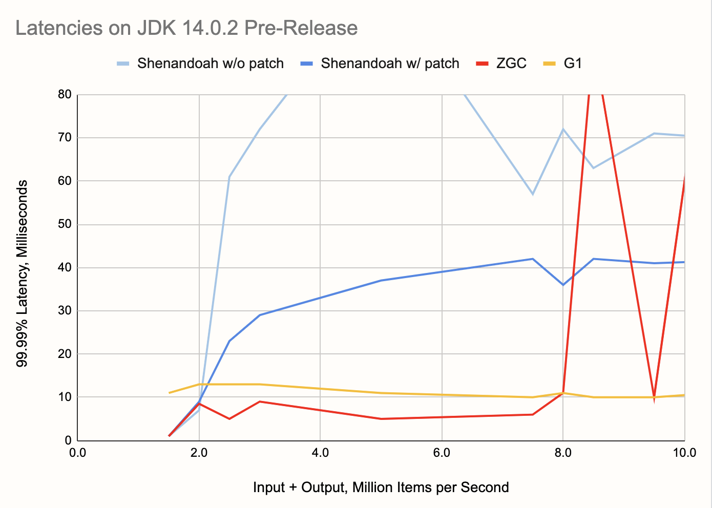

This is a followup to the
[article](/blog/2020/06/09/jdk-gc-benchmarks-part1) published earlier
this month, analyzing the performance of modern JVMs on workloads that
are relevant to the use case of real-time stream processing.

As a quick recap, we tested the basic functionality of Hazelcast Jet,
sliding window aggregation, on two types of workload: lightweight with a
focus on low latency, and heavyweight with a focus on the data pipeline
keeping up with high throughput and large aggregation state. For the
low-latency benchmarks we chose the JDK 14 as the most recent stable
version and three of its garbage collectors: Shenandoah, ZGC, and G1 GC.

Our finding that Shenandoah apparently fared worse than the other GCs
attracted some reactions, most notably from the Shenandoah team who
reproduced our finding, created an
[issue](https://bugs.openjdk.java.net/browse/JDK-8247358), came up with
a fix, and committed it to the jdk/jdk16 repository, all in the span of
a few days. The change pertains to the heuristics that decide how much
work the GC should do in the background in order to exactly match the
applications allocation rate. This component is called the _pacer_. It
was constantly detecting it's falling behind the application and going
into a brief "panic mode" in order to catch up. The fix fine-tunes the
pacer's heuristics.

Given this quick development, we wanted to test out the effects of the
fix, but also take the opportunity to zoom in on the low-latency
streaming case and make a more detailed analysis.

## The JDK We Tested

Since this is all so fresh, we couldn't use an existing JDK release, not
even EA, to see the effects of the fix. JDK version 14.0.2 is slated to
be released on July 14. To nevertheless make progress, we took the
source code from the jdk14u tree, at the changeset number
[57869:e9d41bbaea38](http://hg.openjdk.java.net/jdk-updates/jdk14u/rev/e9d41bbaea38),
and applied the changeset number
[59746:29b4bb22b5e2](https://hg.openjdk.java.net/jdk/jdk/rev/29b4bb22b5e2)
from the main jdk tree on top of it. The jdk14u tree is where JDK 14.0.2
will be released from and the changeset 59746:29b4bb22b5e2 applies the
patch resolving the mentioned Shenandoah issue.

To get a more nuanced insight into the performance, we made some
improvements to the testing code. Whereas in the first iteration we just
reported the maximum latency, this time around we wanted to capture the
entire latency profile. To this end we had to increase the number of
reports per second the pipeline outputs. Initially we set it to 10 times
per second, a number which results in too few data points for the latency
chart. The pipeline in this round emits 100 reports per second. The
length of the time window is the same, 10 seconds, which results in
1,000 hashtables each holding 10,000 keys as the aggregation state. We
tested across a wide range of keyset sizes, starting from 5,000 up to
105,000.

Note that the size of the keyset, somewhat counterintuitively, does not
affect the size of the aggregation state. As long as the 10,000 input
events received during one time slice all use distinct keys, the state
is fixed as described above. Only in the lowest setting, 5,000, the
state is half as large since every hastable contains just 5,000 keys.

What the keyset size does affect is the allocation rate. The pipeline
emits the full keyset every 10 milliseconds. With 10,000 keys that's
1,000,000 result items per second. Since allocation rate and not keyset
size is the relevant factor for GC performance, we use it on the X axis
of the charts we'll be showing in a minute. More precisely, we use the
combined input and output throughput as a proxy for allocation rate.

Here is the basic code of the pipeline:

```java
StreamStage<Long> source = p.readFrom(longSource(EVENTS_PER_SECOND))
                            .withNativeTimestamps(0)
                            .rebalance();
StreamStage<Tuple2<Long, Long>> latencies = source
        .groupingKey(n -> n % NUM_KEYS)
        .window(sliding(WIN_SIZE_MILLIS, SLIDING_STEP_MILLIS))
        .aggregate(counting())
        .filter(kwr -> kwr.getKey() % DIAGNOSTIC_KEYSET_DOWNSAMPLING_FACTOR == 0)
        .mapStateful(DetermineLatency::new, DetermineLatency::map);

latencies.filter(t2 -> t2.f0() < TOTAL_TIME_MILLIS)
         .map(t2 -> String.format("%d,%d", t2.f0(), t2.f1()))
         .writeTo(Sinks.files("/home/ec2-user/laten"));
latencies
      .mapStateful(RecordLatencyHistogram::new, RecordLatencyHistogram::map)
      .writeTo(Sinks.files("/home/ec2-user/bench"));
```

The main part, sliding window aggregation, remains the same, but the
following stages that process the results are new. We write the data to
two files: `laten`, containing all the raw latency data points, and
`bench`, containing a [HDR
Histogram](https://hdrhistogram.github.io/HdrHistogram/plotFiles.html)
of the latencies.

Another key difference is that, in the original post, we measured the
latency of _completing_ to emit a result set, but here we measure the
latency of _starting_ to emit it. This eliminates the fixed cost that is
an intrinsic part of the application code and focuses strictly on the
latency caused by GC overheads or other out-of-band disturbances.

To come up with the charts below, for each data point we let the
pipeline warm up for 20 seconds and then gathered the latencies for 4
minutes, collecting 24,000 samples. The charts show the 99.99th
percentile latencies, which basically means that we remove two samples
with the worst latencies and report the highest latency across the
remaining 23,998 samples. To paint a more intuitive picture, 99.99%
latency tells you that once every 100 seconds, the pipeline experiences
a latency spike at least that large.

Here are two results from the lower end of our measurement range, 2 and
3 million items per second:


We can see that, at 2 million (and presumably less) items per second,
Shenandoah gives about the same results as ZGC, and that the pacer fix
doesn't have an effect. However, at 3 million per second, Shenandoah
latency gets much worse. The pacer fix indeed shows up as a major
improvement, but there is still a lot of latency left. ZGC and G1
perform equally well at both points.

Now we can broaden our view to the full range of throughputs we tested:



Here are some things to note:

1. The G1 collector is unphased by the differences in throughput. While
   its latency is never under 10 milliseconds, it keeps its level over
   the entire tested range and, judging by our previous results,
   probably a lot more.
2. Shenandoah has good latency up to 2 M items per second, but above
   that its latency rises into dozens of milliseconds. The pacer
   improvement has a pretty strong effect, but it doesn't affect the
   bottom line because the success criterion is to stay below 10
   milliseconds.
3. ZGC stays below 10 ms over a large part of the range, up to 8 M items
   per second. Beyond that point its latency steeply rises.
4. At 9.5 M items per second, ZGC shows a remarkable recovery.
   Sandwiched between the latencies of 92 and 209 milliseconds, at this
   exact throughput it achieves 10 ms latency! We of course thought it
   was a measurement error and repeated it for three times, but the
   result was consistent. Maybe there's a lesson in there for the ZGC
   engineers.

As a preview into what's coming up in OpenJDK, we also took a look at
the Early Access release 27 of JDK 15. It lacks the Shenondoah fix, so
to test the prospects for Shenandoah we built the JDK from the jdk/jdk16
repository. Here's what we got:


We can see a nice incremental improvement for the ZGC, but the other
two collectors are essentially the same as before. Shenandoah's chart
looks even a bit worse than above, but with a few repetitions of
measurement for both chart these differences would probably converge.
