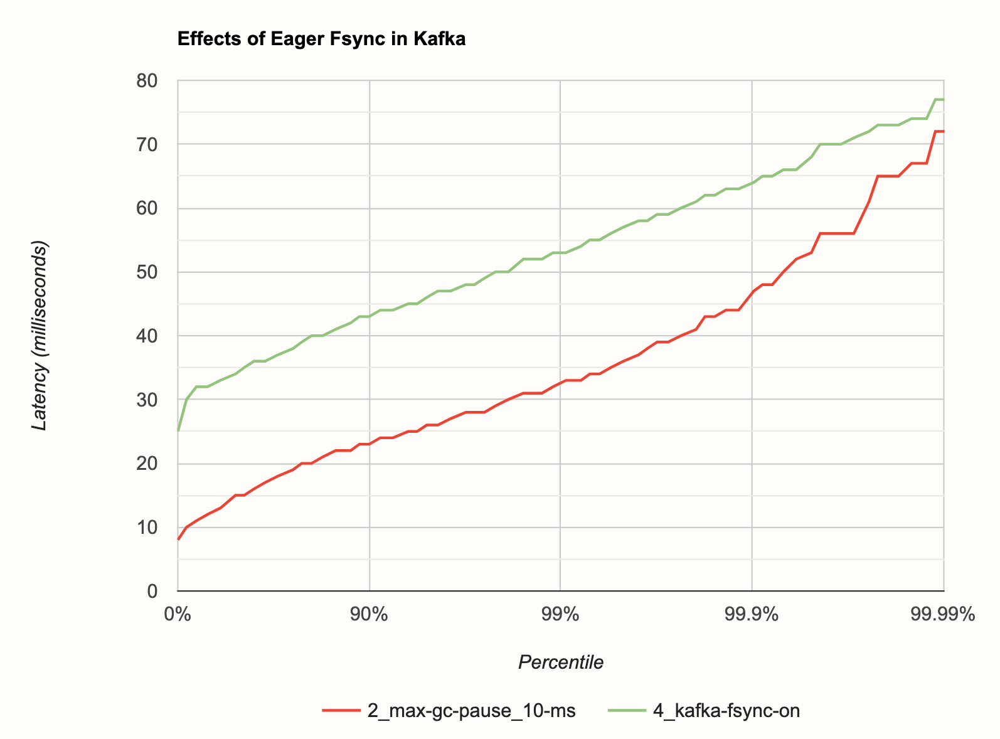

This post is a part of a series:

- [Part 1 (Intro and high-throughput streaming
  benchmark)](/blog/2020/06/09/jdk-gc-benchmarks-part1)
- [Part 2 (batch workload benchmark)](/blog/2020/06/09/jdk-gc-benchmarks-part2)
- [Part 3 (low-latency benchmark)](/blog/2020/06/23/jdk-gc-benchmarks-rematch)
- [Part 4 (concurrent GC with green threads)](/blog/2020/08/05/gc-tuning-for-jet)
- Part 5 (you are here)

Previously we focused on the low-level behavior of the JVM and the
Hazelcast Jet execution engine, and found how to eliminate some sources
of latency at that level. Here we are taking the next step and
broadening our setup to include a total of seven machines: a three-node
Jet cluster, a three-node Kafka cluster that acts as the data source for
Jet, and a node that simulates a stream of events and sends it to Kafka:

As before, we are using EC2 instances: for Kafka we use i3.2xlarge (they
come with a fast 2 TB SSD) and for the rest we use c5.4xlarge. The
instances have 16 vCPUs.

Our event stream simulator uses 12 threads to send 6,000,000 stock trade
events per second to a Kafka topic with 24 partitions and a replication
factor of 3\. The events are about 50,000 different "stock tickers",
which are the keys we use for processing. The message describing an
event that we send to Kafka is very small, including just the timestamp,
5-char ticker, price and quantity. It comes to about 30 bytes.

We leave Kafka's fsync settings at the default, which means there's no
guarantee the data will be fsync'ed to the SSD before getting the
message acknowledgment.

Our stream processing pipeline measures the mean number of trades per
second for each stock over the last 20 seconds, updated every 20
milliseconds. This requires us to maintain a 20-second sliding window of
event counts, sliced into a thousand 20-millisecond buckets, for each of
the 50,000 stocks. We must come up with the sum of all the buckets in
each of the 50,000 sliding windows every 20 millseconds.

The earliest time we can emit our result is after seeing at least one
event &mdash; from each Kafka partition &mdash; that is beyond the
result's timestamp. This is the earliest point at which we can be sure
we accounted for all the events up to the window's end.

Our latency clock starts ticking even before the event simulator has
sent an event to Kafka. The trade events occur at a fixed interval of
1/6,000,000 = 167 nanoseconds and the simulator does its best to send
them to Kafka on time. The clock stops when the Jet streaming pipeline
produces the next events-per-second result.

So the latency includes these components:

1. Time passing from the end of the window to the first event beyond it
2. Event simulator getting ready to send the event to Kafka
3. Event traveling to Kafka (1st network hop)
4. Event traveling from Kafka to Jet (2nd network hop)
5. Event traveling through Jet's pipeline (3rd network hop due to
   partitioning)

The pipeline records each result's latency (a new entry every 20 ms) to
a local file and, when the benchmark is complete, it creates a latency
histogram of the whole run.

## Baseline Run

In order to establish a baseline reading, we used the stock Java ready
for use on AWS: Amazon's Corretto build of OpenJDK 11, without any JVM
parameters. This setup resulted in a **99.99% latency of 120 ms**. This
already looks pretty good for a data path that involves three network
hops (albeit in the same availability zone).

## Basic GC Tuning

As the most basic tuning step, we added `-XX:MaxGCPauseMillis=10` to all
the JVMs involved. This parameter tells the G1 collector how to
configure itself in order to meet our expectation of the longest GC
pause and in the previous benchmarks we found that you can safely go as
low as 10 milliseconds with this setting. Kafka configures itself by
default to `-XX:MaxGCPauseMillis=20`, but the JVM default that was in
effect for the event simulator and Jet, is 200 ms.

With this one change our **99.99% latency dropped to 72 milliseconds**.

## Upgrading to JDK 15 and ZGC

The above result looks so good that our impression was the GC was
probably not a big influence anymore, network latency and any internal
Kafka latency are probably dominating it. To make sure, we made a third
run with JDK 15 and ZGC used for the event simulator and Kafka. ZGC's
weak point is that it's non-generational, and since Jet has significant
medium-lived state, we kept G1 there. We did adjust Jet's cooperative
thread pool size, in order to leave two CPU cores free for G1's
background work. **None of these changes made an impact on latency**.

## Latency Chart

## Eager Fsync in Kafka

While monitoring the benchmark runs, we noticed that there's an uptick
in latency every time the Kafka log rolls to a new segment file. This
could be due to background fsyncing of the file before closing it. We
made a guess that, if we enable eager fsyncing of every individual
message in Kafka, the latency of a single message should go up but it
should also be flatter because there won't be any big fsyncs once every
gigabyte (the default Kafka log segment size). We also anticipated this
would reduce the throughput of the setup.

Our measurement indeed confirmed a drop in throughput, but much less
than we expected: to get good results, we had to dial down the event
rate by just 1M, from 6M to 5M per second. Latency indeed turned out to
be flatter, but once again we were surprised by how little it increased
overall: the 99.99th percentile got even lower than before, to just **60
milliseconds**!

There's a caveat to this result, though: eventually Kafka has to delete
old segment files from the disk, and while it's doing that in the
background, it significantly affects the latency when eager fsync is on.
You can control how long the files can stay and how often Kafka deletes
them, so you could arrange for them to be cleaned in the hours of the
lowest traffic in your data pipeline.

Another thing to have in mind is that we used the `i3` instance type on
EC2, whose SSD hardware is specifically optimized for this kind of
workload.

## RedPanda

_If you enjoyed reading this post, check out Jet at
[GitHub](https://github.com/hazelcast/hazelcast-jet) and give us a
star!_
