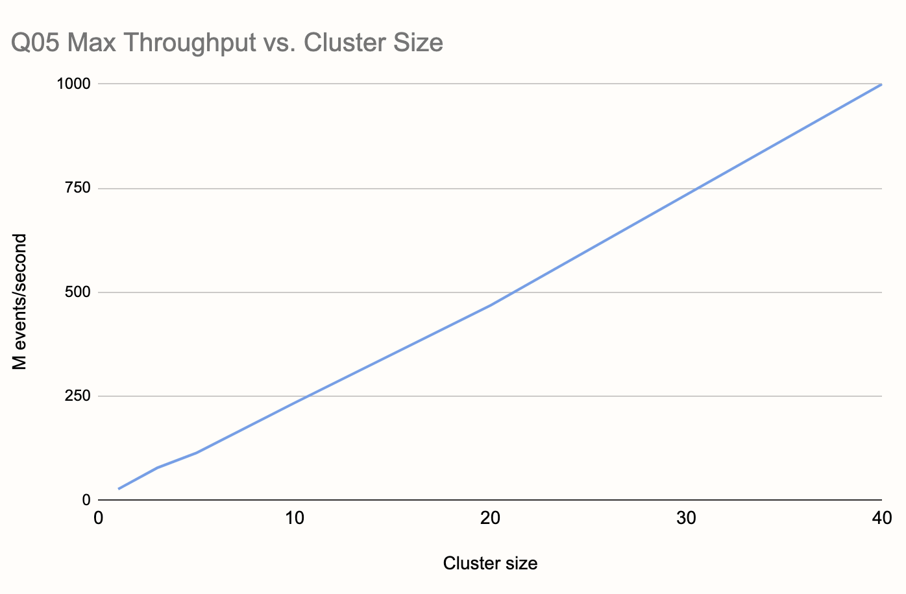
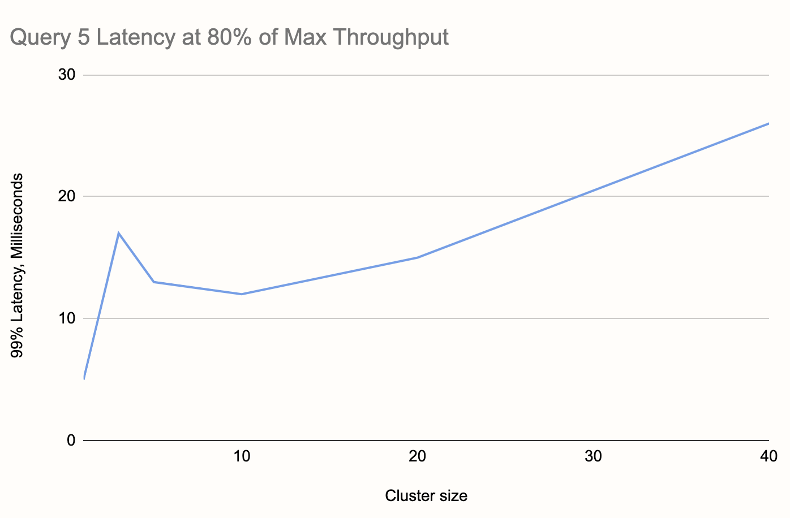

This post is a part of a series:

- [Part 1 (Intro and high-throughput streaming
  benchmark)](/blog/2020/06/09/jdk-gc-benchmarks-part1)
- [Part 2 (batch workload benchmark)](/blog/2020/06/09/jdk-gc-benchmarks-part2)
- [Part 3 (low-latency benchmark)](/blog/2020/06/23/jdk-gc-benchmarks-rematch)
- [Part 4 (concurrent GC with green threads)](/blog/2020/08/05/gc-tuning-for-jet)
- Part 5 (you are here)

We're preparing a scientific paper on Hazelcast Jet, describing its
architecture based on symmetric, data-local, non-blocking distributed
event processing. As a part of this effort, we implemented the
vendor-neutral [NEXMark](http://datalab.cs.pdx.edu/niagara/NEXMark/)
benchmark suite, consisting of 8 streaming queries that aim to capture
typical kinds of questions you're likely to ask about your real-time
data.

The queries deal with a domain model of auctions, sellers, and bids. For
example, Query 5 asks: "Which auctions have achieved the highest price
in the last period?"

In contrast to our previous benchmarks, which focused on single-node
performance (especially GC-induced latency spikes), this time we focus
on horizontal scalability: how do Jet's latency and throughput behave as
you add more and more nodes?

In a cluster of 45 nodes and 720 vCPUs, Jet reached **1 billion
events per second** at a 99% latency of **26 milliseconds**.

## Our Setup

We used the same configuration as in our earlier benchmarks:

- EC2 instance type
  [c5.4xlarge](https://aws.amazon.com/ec2/instance-types/c5/) (16 vCPUs)
- Oracle OpenJDK 15.0.1 with a single GC parameter:
  `-XX:MaxGCPauseMillis`
- Hazelcast 4.3
- Jet's thread pool size: 12 or 14

In our [previous experience](/blog/2020/08/05/gc-tuning-for-jet), we
found you don't need any low-level GC tuning parameters to get great
latency results on the JVM, but you do have to use a recent JDK. We let
the JVM use its default G1 collector and configured it with our desired
GC pause target. Also, note that we size Jet's thread pool a bit below
the system capacity: up to 14 threads on 16-vCPU machines. This
important trick allows the GC to work in the background without
interfering with Jet's real-time computations.

As for the measuring methodology, it is the same as before. Events come
from a generator that lives inside the same JVM as Jet. Every event has
a predetermined moment of occurrence, and it is the generator's duty to
emit it as soon as possible once that time has arrived. Any latency in
emitting the event counts towards the reported latency.

On the output side, we stop the latency clock as soon we observe some
data item corresponding to the newest result. We compare the system time
at that point with the moment at which the query result would ideally
become known. For example, if the query involves a time window, then
the moment at which the window "closes", is that ideal moment.

We don't require Jet to send the results to any outside system, because
we want our results to focus on Jet's performance alone. The code we
used in the benchmark is available on
[GitHub](https://github.com/hazelcast/big-data-benchmark/tree/master/nexmark-jet/src/main/java/com/hazelcast/jet/benchmark/nexmark).

## Benchmark 1: 99.99th Percentile Latency with 20 ms Time Resolution

For the first benchmark we asked this question: using a time resolution
of 50 result updates per second and an input rate of 1 million events
per second, what is the 99.99% latency at different cluster sizes?

The main point of this benchmark is probing deep into the rare system
events that may cause latency spikes, however the original definitions
of NEXMark queries ask for a very low update frequency (once per
minute). At this rate it would take 100 minutes to get barely enough
data to report the 99th percentile latency, and a whole week to get the
99.99th percentile. Therefore we changed this to 50 times per second
(20-millisecond update period).

Having to report another complete set of results (10,000 data points)
every 20 milliseconds, Jet doesn't have time to recover from any hiccup
greater than a few milliseconds. For this reason we configured the GC
pause target to 5 milliseconds (`-XX:MaxGCPauseMillis=5`).

NEXMark doesn't define the number of distinct keys involved in the
queries, we set it to 10,000 for this benchmark.

We used the setting of 12 Jet threads per node, mostly because that's
what we used in the previous benchmarks. We got these results:

The overall worst case was Query 5 in the largest cluster (20 nodes),
and it came out as 16 milliseconds.

## Benchmark 2: 99th Percentile Latency at a Billion Events per Second

Our second question was this: How much hardware would Jet need to reach
a throughput of a billion events per second, while maintaining its
millisecond-level latency?

To test this, we selected the NEXMark query that seemed the toughest on
Jet given the results from Benchmark 1. This is Query 5, which showed
a 99.99% latency 16 milliseconds in a 20-node cluster.

In this round we relaxed the timings a bit, setting the goal to two
updates per second (a new result set every 500 milliseconds), and
accordingly had to adjust our percentile to 99% in order to make it
practical. We also relaxed the GC timing, setting
`-XX:MaxGCPauseMillis=50`.

We started with just a single node, finding the maximum event rate Jet
can keep up with. The definition of "keeping up" is that the latency
stays bounded during the test and doesn't constantly increase. We
repeated the process at increasing cluster sizes, until reaching our
goal of one billion. Here is what we found:

First of all, Jet was able to handle **25 million events per second on a
single node** and, even more impressively, this number kept scaling
linearly all the way to our target, which it reached at a size of 40
nodes.

During the process we realized we could let Jet use more threads without
impacting the latency, and since we wanted to minimize the number of EC2
instances, we let it use 14 threads. This still leaves 2 vCPUs to the
background GC work and other system needs. If you look carefully, you
can see the curve in the chart bending slightly upwards at the 20-node
mark, this is an artifact of the 40-node measurements being taken with
Jet using 8.6% more threads per node (14 vs. 12).

Since the criterion for maximum throughput is just keeping up with the
input, allowing the latency to temporarily reach higher values as long
as it settles back down, we did another round of tests at 80% of the
maximum throughput determined for each cluster size. This gave us the
following latency chart:

We can see that, although it's increasing, the latency stays pretty flat
across a range of sizes well exceeding the capacity you'd probably need
from Jet in real life.

Finally, we started from the setup that supported a billion events per
second (40 nodes) and continued adding nodes until we got stable low
latency. This was our result: **45 nodes, 26 milliseconds**.

_If you enjoyed reading this post, check out Jet at
[GitHub](https://github.com/hazelcast/hazelcast-jet) and give us a
star!_
